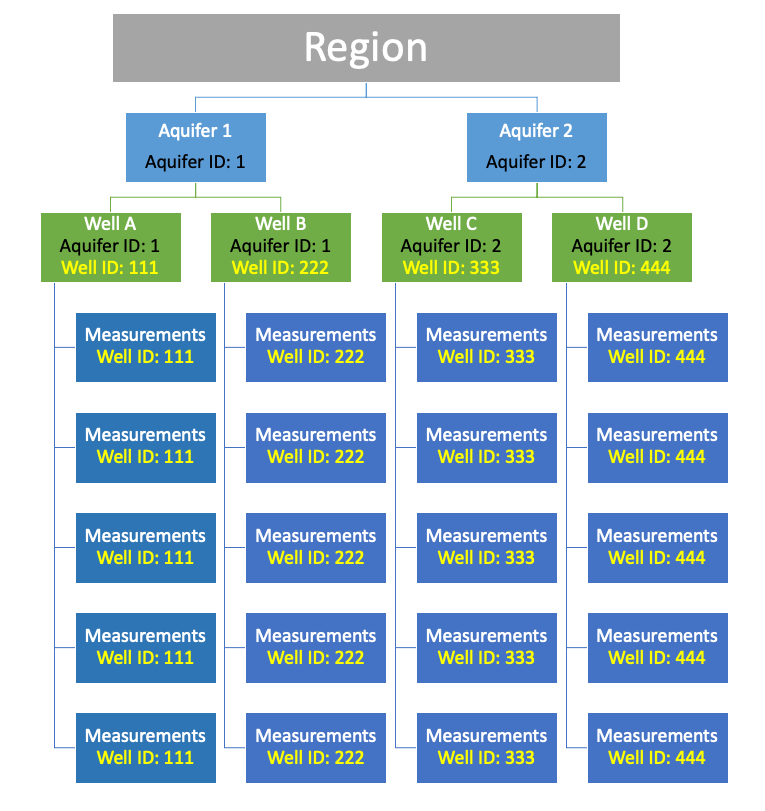
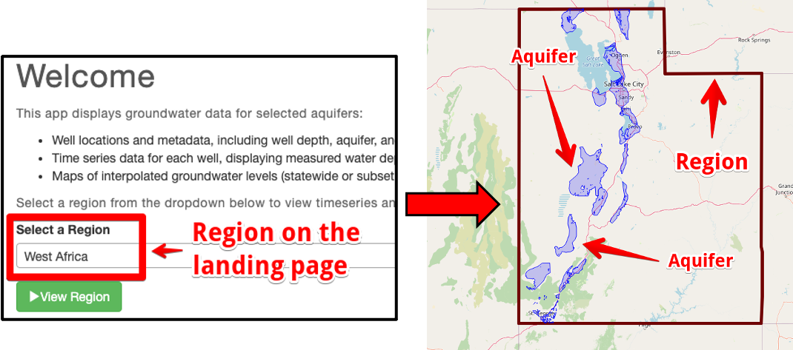
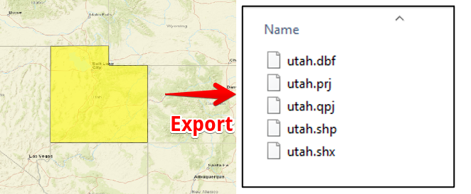
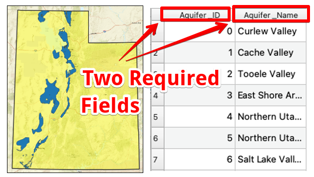
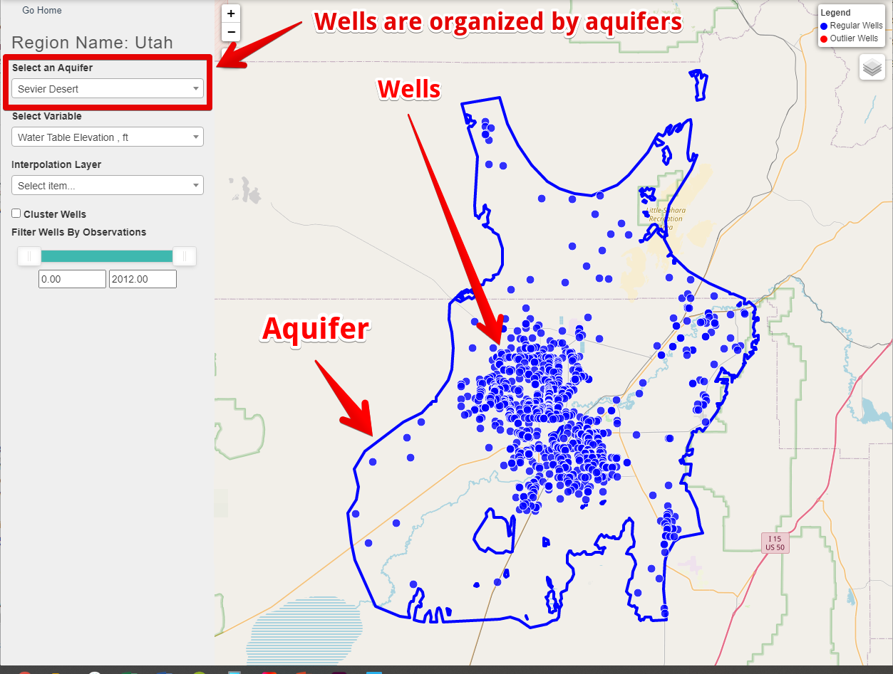
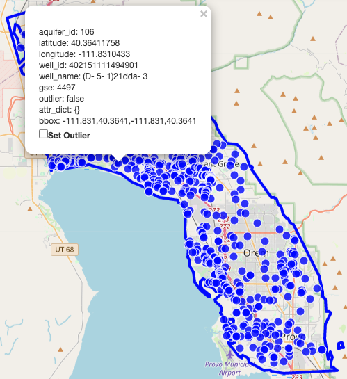
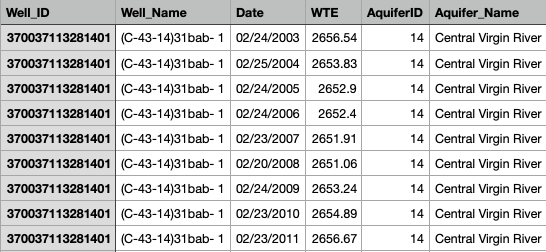

# **Data Preparation**

## **Introduction**

Before importing data into the GWDM app, the following data content needs to be collected and prepared:

:   -   Region Boundary
    -   Aquifers
    -   Well locations
    -   Measurements (Time Series Data)

A region is typically a state, country, or water management agency
boundary and represents the top of the data hierarchy. In one region,
there may be one or more aquifers in which wells are located. Each well
may have time series data in one or multiple files that show historical
trends of groundwater data such as water table elevations, water
quality, etc. The following diagram graphically illustrates the
relationship of the different data components:

{width="765px" height="811px"}

This page will walk you through how to prepare the appropriate files
needed to import data into the app and provide links to complementary
tools designed to aid in this data preparation process.

## **Regions & Aquifers**

The first step of organizing groundwater data in the GWDM app is
uploading region and aquifer files where the wells are located. In the
app, region is the first \"filter\" that users see on the landing page.
Data are then organized by aquifer in the next page.

{width="1070px"
height="473px"}

Region and aquifers files have to be one of the following data types:

> -   Shapefile (.shp, .shx, and. dbf are required)
> -   GeoJSON file (.geojson)

In the examples used on this page, the state of Utah (USA) was used as a
region boundary in a shapefile and Utah\'s major aquifers were prepared
in a .geojson file. When exporting shapefiles from a utility such as
Esri ArcGIS or QGIS, the shapefile should be exported as a 2D object,
not a 3D object (no Z coordinate). This is because the PostGIS database
used to store the objects in the GWDM only supports 2D shapes.
Shapefiles with Z coordinates will result in an error message when
importing to ArcGIS. In our experience, shapefiles and GeoJSON objects
exported from QGIS are more likely to import correctly than shapes
exported from ArcGIS.

## **Region (State Boundary)**

For this example, QGIS was used to export the region boundary (the state
of Utah) as a shapefile. You can often find regional shapefiles on the
internet. Regardless of where you get your shapefile, the exported files
should consist of multiple files as seen below.

{width="662px"
height="274px"}

Also, make sure the shapefile does NOT include Z coordinates as this
will generate an error when you attempt to import the file. The PostGIS
database used by the GWDM to store the region and aquifer boundaries
only supports two-dimensional shapes.

## **Aquifer**

The aquifers in your region will also need to be organized in either a
geojson file or a shapefile. The attribute table for the aquifer file
has two fields (columns) that are required to upload the file to the
app: an aquifer name representing the unique name of the aquifer and an
**aquifer ID**, a unique integer ID.

+-----------+--------+------------------------------------------------+
| Field     | Type   | Description                                    |
+===========+========+================================================+
| Aquifer   | Text   | The names should uniquely describe the         |
| Name      |        | aquifers                                       |
+-----------+--------+------------------------------------------------+
| Aquifer   | > N    | The integer IDs should be unique (not have     |
| ID        | umeric | duplicate values)                              |
+-----------+--------+------------------------------------------------+

{width="629px" height="335px"}

## **Well Locations File**

Well locations are organized in CSV files where each row represents a
well location and the columns represent well attributes. These typically
can be exported from Excel or from a well database.

Wells are organized by aquifers in the app. There are two ways to
prepare well locations files.

1.  Create a single CSV file with all wells and assign each well an
    aquifer ID corresponding to the aquifer it is located in. This
    allows the GWDM app to match the aquifer ID attribute from the well
    location file to the aquifer ID that was input with the aquifer
    polygons in the previous step. This allows you to import all of the
    wells associated with your region in a single step. However, it does
    require that you have aquifer IDs associated with your wells. If you
    do not have Aquifer IDs, you can use one of the support scripts we
    have provided to automatically generate the IDs based on the aquifer
    polygon files and the well coordinates.
2.  Create a separate CSV file that contains only wells belonging to a
    single aquifer. This method does not require an aquifer ID as all of
    the wells are imported to an assigned aquifer. With this method, you
    create multiple well files, one per aquifer, and then import the
    wells one at a time. Each time you import the wells, you explicitly
    select the aquifer polygon the wells should be assigned to.

A well location file must include the well coordinates (latitude and
longitude in a decimal degree format), well names, and well IDs. If you
are using method #1 described above, an aquifer ID field is also
required.

The required fields (columns) for a wells file are:

  ----------- ---------- --------------------------------------------------------- --
  **Field**   **Type**   **Description**                                           

  Latitude    Numeric    Latitude must be input in a decimal degree format.        

  Longitude   Numeric    Longitude must be input in a decimal degree format. \|    

  Well name   Text or    This is a text string or number used to identify the      
              Numeric    well.                                                     

  Well ID     Text or    Well ID has to be a unique value and must not have        
              Numeric    duplicates within an aquifer. There can be duplicate well 
                         IDs in different aquifers (i.e. There can be the same     
                         well ID in different aquifers) \|                         

  Ground      Numeric    OPTIONAL: This field only serves as a metadata purpose.   
  Surface                                                                          
  Elevation                                                                        

  Aquifer ID  Text or    If a file contains wells from multiple aquifers, this     
              Integer    field is mandatory. \| OPTIONAL if a file only contains   
                         wells from a single aquifer. See the description above    
                         for the two methods for importing well locations.         
  ----------- ---------- --------------------------------------------------------- --

This is a sample well locations file:

## **Measurements File**

A measurement file is a CSV file containing the groundwater data
measurements. Each measurement has a date, a data value, and a well ID
that relates the measurements to the corresponding well. An aquifer ID
column is optional depending on how the measurement file is prepared.
Like a well locations file, there are two ways to prepare a measurement
file.

> 1\. Create a single CSV file with all wells and groundwater
> measurements and assign each measurement/well an aquifer ID
> corresponding to the aquifer it is located in. This allows having the
> same well IDs from different aquifers in a single file (i.e. There can
> be wells with the same well IDs if they are located in different
> aquifers). This method allows you to import all of the measurements
> and wells in a single step. However, it does require that you have
> aquifer IDs associated with your measurements/wells. We also provided
> the support scripts to automatically format the uploading file with
> the well and aquifer IDs.
>
> 2\. Create a separate CSV file that contains only measurements/wells
> belonging to a single aquifer. This method does not require an aquifer
> ID as all of the measurements/wells are imported to an assigned
> aquifer. With this method, you create multiple well files, one per
> aquifer, and then import the measurements/wells one at a time. Each
> time you import the measurements/wells, you explicitly select the
> aquifer polygon the wells should be assigned to. In the GWDM app, the
> measurements associated with a well can be displayed as a time series
> curve as shown below. Measurements are also interpolated in time and
> space using the Mapping Google Collab Notebook to created time-varying
> rasters that can be animated or used to compute changes in aquifer
> storage vs time.

The required fields (columns) for a measurements file are:

  ------------------------------------------------------------------------------------
  Field            Type      Description                                            
  ---------------- --------- ------------------------------------------------------ --
  Well ID          Numeric   This well ID should be related to one of the well ID   
                             values defined in the Well Locations file described    
                             above.                                                 

  Date             Date      The date that the measurement was taken. The dates can 
                             be in almost any format\*. \| When the measurements    
                             are imported, the user has the option to define the    
                             date format so that the dates are properly             
                             interpreted. \*The Unix Epoch begins in 1970, so any   
                             dates before 1970 will need to be 4-digit years;       
                             otherwise, they will be converted to the next \|       
                             century (e.g. 1/1/69 will be converted to 1/1/2069;    
                             1/1/1969 will remain 1/1/1969) \|                      

  Measurement(s)   Numeric   This column contains the actual measurements (water    
                             table elevation, depth to groundwater, water quality,  
                             etc). You can have one or multiple data columns.       

  Aquifer ID       Text or   This field is optional if all the measurements are     
                   Integer   from a single aquifer. This field is required if the   
                             uploaded files contain measurements/wells from         
                             multiple aquifers. This aquifer ID should be related   
                             to one of the aquifer ID values defined in the Well    
                             Locations file described above.                        
  ------------------------------------------------------------------------------------

This is a sample measurements file. Note that a measurements file can
contain extra fields or columns. These columns are ignored when the data
are imported. The data import process allows the user to designate which
columns contain the required data. In this example, the only fields
imported are Well_ID, Date, and WTE (water table elevation). The other
fields are ignored. When preparing the measurements file, one should be
careful to only include measurements associated with wells that have
already been uploaded into the GWDM.

## **Support Tools**

Collecting, filtering, and formatting well and measurement data can be a
complicated process, especially with large datasets. To assist in this
process, we have created a set of Python scripts that aid in the
generation of ground surface elevations (GSEs), obtaining existing well
data from USGS, adding Aquifer IDs, and other formatting options. Each
script is contained within a Google Collaboratory notebook. For more
information regarding these scripts, go to the Support Scripts page. The
scripts include tools for the following tasks:

> -   Ground surface elevations are necessary to convert
>     depth-to-water-table measurements to water table elevations. If
>     your wells do not include ground surface elevations, the
>     elevations can be sampled from a 30-meter DEM using the
>     **Elevation Generator Tool**.
> -   For locations in the United States, both well locations and
>     measurements can be downloaded directly from the USGS NWIS
>     database using the **NWIS Data Retriever Tool**.
> -   You can assign aquifer names and IDs to wells, calculate water
>     table elevations from depth to water table measurements, and clean
>     up your data with other formatting options using the **Data
>     Formatting Tool**.

## **Summary**

In summary, the app organizes aquifers, wells, and measurements in the
relationship presented below under a region. Note how the various
feature IDs are used to create relationships between regions, aquifers,
wells, and measurements.

