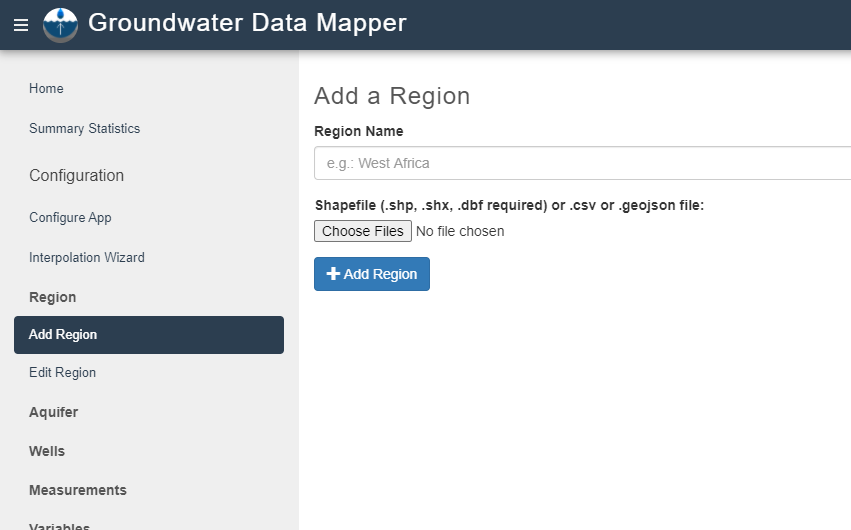
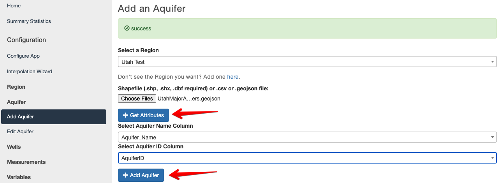
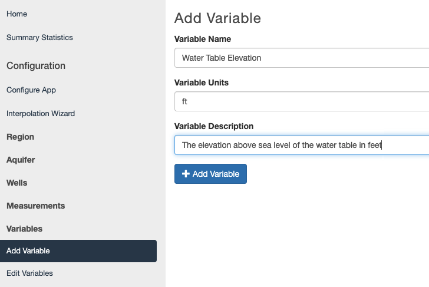
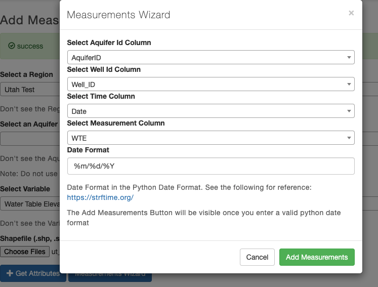
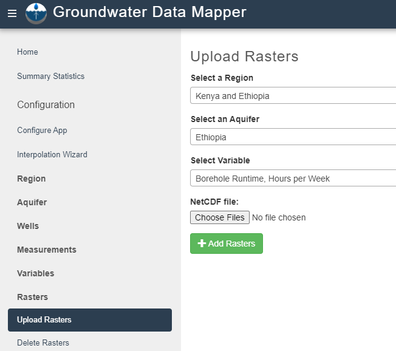
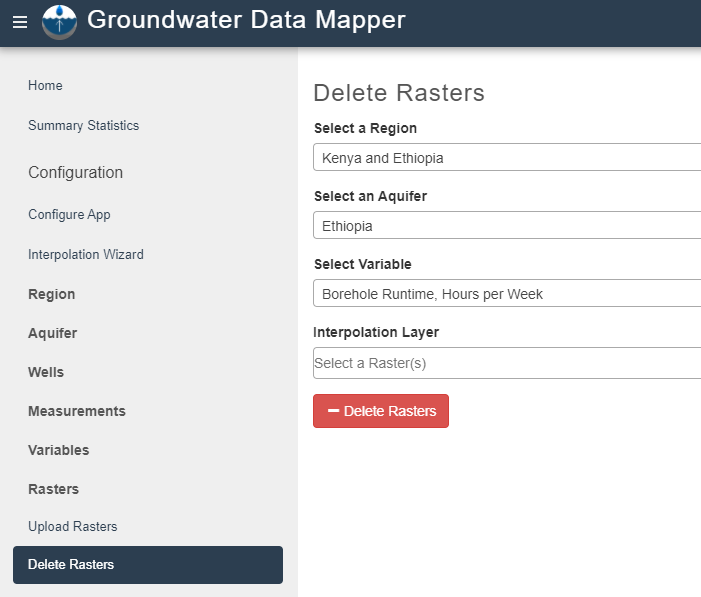
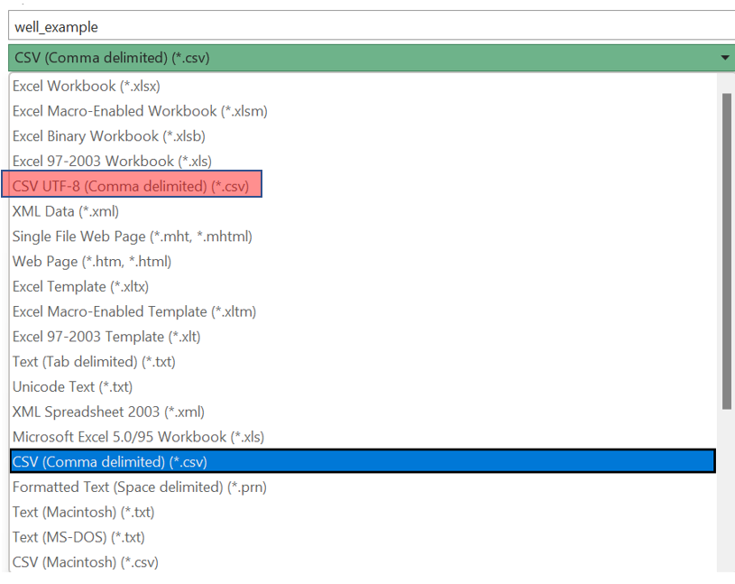

{{ include_file('docs/translate.html') }}

# **Importing Data**

## **Introduction**

To demonstrate the data import process, an example set of data has been
provided. Download and unzip the attached files or organize your own
files to follow along.

[utah_test_files.zip](test_files/utah_test_files.zip)

## **Add Region**

First, we must add a region. To do this, navigate to the main landing
page (if you are not logged in with admin privileges, you will need to
first obtain these credentials). Select the region tab on the left, then
click on the **Add Region** link on the dropdown.

Type in the name of your region and click the Choose Files button to
open a file browser. From there you can select a shapefile set, a csv,
or a geojson file. The example file in this demo is a set of shapefile
files for the Utah state boundary. Note that shapefiles require .shp,
.shx, and .dbf files, although .prj files are also good to include.

To ensure that your region was loaded properly, you can go to the **Edit
Region** tab and click on the **View** icon for your region. This will
display your region boundaries on a map. From this page, you can also
edit the name of the region or delete a region using the appropriate
icons.

## **Add Aquifer**

Next, we will add the aquifers. To do this, we will follow a similar
process to that of adding a region. First, we select the region where
the aquifers are located. The dropdown list will display all previously
uploaded regions.

After selecting the region, a shapefile must be loaded. This time, we
will use a geojson file type that contains aquifers in Utah.

Once the file is added, we click **Get Attributes** to define the
aquifer name and ID. An aquifer name and ID should be specified for each
aquifer in the file. In the case of the example Utah file, the
appropriate attributes are *Aquifer_Name* and *AquiferID* (note that not
all files will have intuitive names for these attributes). Finally, we
add the aquifer with the **Add Aquifer** button. Once the aquifer(s) are
loaded, they can be viewed, edited, or deleted on the **Edit Aquifer**
tab (editing an aquifer includes an ability to edit its aquifer ID;
however, this ID is used to connect wells to aquifers, so be careful
with this capability).

## **Add Wells**

Next, we will add the wells using the **Add Wells** command in the Wells
section. These wells have already been assigned to their respective
aquifers, so we can add them all at once. If you would like to add wells
to a single aquifer at a time, pre-assigning aquifer IDs is unnecessary.

To add a list of wells, we select the region of interest. Since we have
pre-assigned aquifer IDs, we will not select a single aquifer from the
list; rather, we will leave the field blank. This time, we will use a
csv file (although shapefiles can also be used). We again use the **Get
Attributes** button to retrieve the column headers from the file. The
**Wells Wizard** will automatically open up, wherein we can select the
columns for latitude, longitude, aquifer ID (not necessary if a single
aquifer was selected previously), well name, well ID, and ground surface
elevation (GSE). For this example file, the appropriate headers are
lat_dec, long_dec, AquiferID, Well_Name, Well_ID, and GSE, respectively.
Finally, we click the **Add Wells** button to add the wells to the app.

Again, the wells can be viewed or deleted from the **Edit Wells** tab.
All wells in an aquifer can also be deleted en masse using the **Delete
Wells by Aquifer** tab.

## **Add Measurements**

Finally, we can add the measurements. Before we can add a measurements
file, we need to ensure that our variable is defined. The app is
variable agnostic, meaning any variable can be defined and used to label
measurements that are uploaded. Variables can be defined using the **Add
Variable** tab under **Variables**. A variable name, units, and
description needs to be specified and the variable is added with the
**Add Variable** button.

Measurements are added with the **Add Measurements** tab under
**Measurements**. The region and variable that we defined earlier can be
selected from the respective dropdown menu. However, just as with the
wells, measurements can be added to all aquifers (with AquiferID defined
for each measurement) or to an individual well (using the Select an
Aquifer dropdown menu).

Our example file includes measurements of water table elevation from
wells across Utah, so we will leave the *Select an Aquifer* option
blank. We assign the attributes to the appropriate column using the
**Get Attributes** button and **Measurements Wizard** window. The
headers for our example file are AquiferID, Well_ID, Date, and WTE, as
seen below. The date format must be in the Python Date Format, which can
be referenced at: [https://strftime.org/](https://strftime.org/){:target="blank"}. A list of common date formats
can be found below (to determine which date format your file uses, it is
strongly recommended to open your file in a text editor, as MS Excel
often reformats data). The **Add Measurements** button will add the
measurements to the wells in the region.

| **Date/Time Format**     | **Example**              | **Python Format**      | **Notes**                                                                                                                                                                                                                                                                                    |   
|------------------------|------------------------|----------------------|---------------------------------------------------------------------------------------------------------------------------------------------------------------------------------------------------------------------------------------------------------------------------------------------------|
| YYYY-MM-DD               | 2020-01-09               | %Y-%m-%d               | \-\-                                                                                                                                                                                                                                                                                            |
| M/D/YY                   | 1/9/20                   | %m/%d/%y               | Please note that 2-digit years will cause errors if you have dates in your dataset before 1970 (please see Data Prep Section). 4-digit years are best.                                                                                                                                      |
| D/M/YY                   | 9/1/20                   | %d/%m/%y               | See above                                                                                                                                                                                                                                                                                       |
| MM/DD/YYYY               | 01/09/2020               | %m/%d/%Y               | \-\-                                                                                                                                                                                                                                                                                            |
| DD/MM/YYYY               | 09/01/2020               | %d/%m/%Y               | \-\-                                                                                                                                                                                                                                                                                            |
| DD/MM/YYYY or HH:MM:SS   | 09/01/2020 or 13:35:10   | %d/%m/%Y or %H:%M:%S   | For groundwater data, the time is generally not recorded and is not normally required for the GWDM app, considering the time scales typically encountered. Therefore, we recommend only using the date portion of the date field. |

For a complete description, visit: [https://strftime.org/](https://strftime.org/){target="blank"}.

!!! Warning
    If you receive an error while trying to upload measurements, the first
    thing that you should check is that you specified the correct date
    format.

Measurements can be deleted by aquifer and variable type through the
**Delete Measurements** tab. When adding measurements, care should be
taken to only upload measurements associated with wells that have
previously been uploaded to the GWDM. Otherwise, the measurements will
be skipped when uploading and after the uploading process is complete, a
message similar to this will appear:

## **Rasters**

One of the main functions of the GWDM app is to use temporal and spatial
interpolation to create time-varying rasters of groundwater data (water
level, depth to groundwater, etc). This process is described in the
Groundwater Level Mapping section. Interpolated rasters can be animated
in the main map window using the Leaflet animation plug-in used by the
GWDM.

In some cases, users may elect to use external interpolation algorithms
to generate rasters for their aquifers. The Rasters section in the admin
control panel can be used to upload and manage these externally
generated rasters. Once uploaded, they can be animated and visualized in
the GWDM map window.

The **Upload Rasters** command is used to upload raster datasets in
netCDF format. The user must first select the region, aquifer, and
variable and then choose the netCDF file.

Once a raster has been uploaded, it can be selected for visualization by
choosing the View Region option, selecting the region, and then
selecting the aquifer and variable. The uploaded raster can then be
selected using the Interpolation Layer option.

The **Delete Rasters** command is used to delete previously uploaded
rasters. The user selects the region, aquifer, variable, and raster and
then selects the Delete Rasters button. If the \"All Aquifers\" option
is selected in the \"Select an Aquifer\" list, all rasters associated
with the region are deleted. Likewise, the \"Select Variable\" and
\"Interpolation Layer\" options both have an \"All \_\_\_\" option to
delete all rasters for any variable or all rasters for a selected
variable.

## **Trouble Shooting**

If you are having trouble getting your data to upload correctly, this
section includes several common problems and how to fix them.

**CSV Encoding**

If your CSV files are encoded (intentionally or accidentally), the
app\'s wizard will not recognize your files\' attributes. When you open
the wizard, only one attribute will display. To fix this error, save a
copy of your file with the option highlighted in blue as opposed to the
option highlighted in red in the figure below. If the error persists,
copy your data into a new document and save without encoding.

> 
>
> **Selecting an Aquifer**

If you have received the error pictured above, you selected an aquifer
when you did not need to. If you have organized your data using aquifer
IDs then the aquifer option blank must be left blank when you are adding
wells and measurements. You will need to refresh the page to make the
aquifer option blank again and then leave it blank while you are adding
your wells. After you refresh be sure to reselect your region.

**Dropped Data**

When adding measurements, care should be taken to only upload
measurements associated with wells that have previously been uploaded to
the GWDM. Otherwise, the measurements will be skipped when uploading and
after the uploading process is complete, a message similar to this will
appear:

There are two ways to fix this issue depending on what is causing it. In
some cases, the measurements are dropped because the well ID refers to a
non-existent well. To fix this you can run our file formatter tool
located in the Data Preparation Scripts section. In other cases, the
well is assigned to a non-existent aquifer which can be fixed by running
our aquifer assignment tool which can also be found on our Data
Preparation scripts page.
