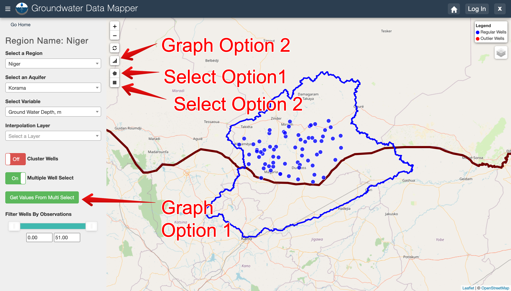
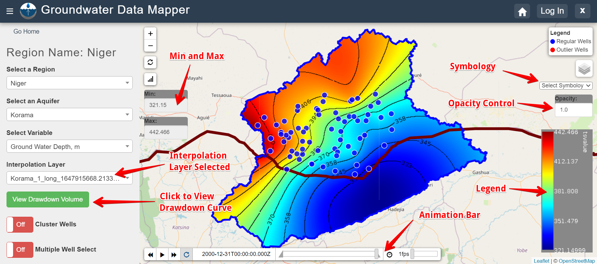

.. raw:: html
   :file: translate.html
   
**INTRODUCTION**
=================
Water managers in Western Africa and around the world face the daunting task of managing freshwater resources in the face of increased demand from industry, agriculture, climate change, and population growth. As surface water resources become fully allocated, groundwater is increasingly targeted to make up surface water deficits, particularly during periods of drought. As a result, many of our aquifers are not being managed in a sustainable fashion, resulting in reduced water quality, land subsidence, increased pumping costs, and in some cases, the complete exhaustion of an aquifer and the loss of groundwater as a buffer during times of drought.

**Mapping Algorithm**
---------------------

Even when water managers have access to large data sets of historical groundwater level measurements, at any individual well these measurements often exhibit significant time gaps. Aggregating and synthesizing these well measurements to provide information that supports a holistic assessment of aquifer level sustainability can be a challenging task. In partnership with NASA SERVIR, we have developed a series of algorithms that use these existing well measurements combined with Earth Observation data to analyze changes in water tables and characterize aquifer storage over time. Our approach involves collecting data describing well locations and any historical water level measurements in an aquifer. To evaluate aquifer behavior, we need to impute missing data at each well location so that we have data at each time step for analysis. To impute these data, we use a machine learning approach, to train models to use Earth Observation data to impute (or estimate) missing measurements at each well. Using this approach, we generate a time series for each well and use these data to spatially interpolate the water table at each time step.

These interpolated water table maps can be used to evaluate the sustainability of the aquifer by looking at the changes to aquifer storage over time. We have shown that our approach can deal with gaps resulting from long periods with no measurements at wells, our machine learning algorithms build correlations between existing water level measurements and Earth observations such as water storage changes from the NASA Gravity Recovery and Climate Experiment (GRACE) mission, soil moisture from the Global Land Data Assimilation System (GLDAS), or the Palmer Drought Severity Index (PDSI). These machine learning methods have shown to be remarkably accurate for data imputation and extrapolation. The product of this process is a series of time-varying rasters that can be animated to allow water managers to visualize how the water levels are changing over time and where the aquifer is being stressed. The rasters can also be analyzed to assess the change in aquifer water volume or storage over time – a key indicator of aquifer health and sustainability.

**Tethys Application**
-----------------------
We have incorporated our groundwater level mapping algorithms in a simple, easy-to-use web application created using Tethys Platform, developed in our hydroinformatics laboratory. In addition to the water level mapping, the system provides a powerful online database of historical groundwater data where users can zoom in to areas of interest, select wells, and view the historical water level record and meta-data about each well.

The GWDM app can be accessed in the following locations:

* **Servir West Africa Portal**: official Tethys portal hosted by the SERVIR Science Coordination Office (SCO) for the West Africa Hub (https://tethyswa.servirglobal.net/apps/)
* **BYU Portal**: a Tethys portal hosted by Brigham Young University for all completed apps (https://tethys.byu.edu)
* **GEOGloWS Portal**: a portal associated with the GEOGloWS organization (https://apps.geoglows.org/apps/)
* **INDRHI GEOGloWS Portal**: a Tethys portal used by INDRHI, the national institute for hydraulics in the Dominican Republic (https://indrhi.geoglows.org/apps/)
* **GEOGloWS Portal**: a portal associated with the GEOGloWS organization (https://apps.geoglows.org/apps/)

**Regions, Aquifers, and Well Data**
------------------------------------
For any of the portals, you can access the app by clicking on the Groundwater Data Mapper icon. Once you are in the app, you will see the landing page:

Select a region and then click on the **View Region** button. In the GWDM tool, data are first organized by region and then by aquifer. When you click on the View Region button, you will see a map of the selected region and the corresponding aquifers. To view well data, you need to select an aquifer. Once you select an aquifer, the app will zoom in on the aquifer and display all wells associated with the aquifer. The well data consists of two parts:

1) Well Locations

2) Historical observations at the wells.

The observations are typically water levels that can be represented either as depth to water table or water table elevations, but any variable is supported and could include water quality data. The regions, aquifers, wells, and measurements are imported through an admin interface that is described in more detail in the subpages associated with the GWDM on this website.

**Controls**
-------------
On the left side of the map, you will see a set of controls :

**Select an Aquifer**: This is used to switch between aquifers in the region as described above.

**Select Variable**: The well data may have historical measurements of different types. Use this to select the type you wish to explore.

**Interpolation Layer**: If the interpolation algorithm has been used to generate aquifer maps, the resulting maps are listed in this drop-down list. These are netCDF files that are displayed as color contours in the map window on the right. See section below on displaying rasters.

**Cluster Wells**: For aquifers with large numbers of wells, this feature can be used to simplify the display by grouping sets of adjacent wells into clusters. You can see the individual wells by zooming in or by clicking on the clusters.

**Multiple Well select** : This is used to select and display time series plots for multiple wells. See section below for more details.

**Filter Wells by Observations**: These controls show the min and max number of measurements associated with individual wells in the aquifer. By changing the two values, you can filter which wells are displayed. For example, to only show wells that actually contain at least one measurement, change the min value on the left to something other than zero.

**Reset** : The reset button is located just above the graphing button to the right of the control panel and is used to return to the region home

To explore the well data, you can click on individual wells to see metadata about the well. If the well contains historical measurements, they are plotted as a time series graph at the bottom of the screen.

**Selecting and displaying multiple wells**
---------
It may be helpful to compare wells within the same aquifer that may not necessarily fall under the same cluster groups. One would need to select which variable to compare before activating the Multi Well Select. To activate this command, simply click on the button which will then turn green and three more options will be added to the screen. Here is a picture of all the options that will be available once the Multiple Well Select is activate;

**Select Option 1** : This select method allows the user to draw a polygon by clicking around the wells interested in. This option allows one to draw any closed polygon around any wells that one wish to visualize.

Once the polygon created is closed, a message box will appear giving you an option to view the time series. When you click on the view time series, a Multi Wells Chart will appear on your screen comparing the time series of the selected wells. If you click cancel, you can still visualize your selected wells by clicking on the Graph Option 2 whose icon looks like a bar graph.

Here is an image of the results from our previous selection. Notice that the chart only shows available data and skips any missing data.

**Select Option 2** : This option is similar to the first option. The only difference is that this shape is fixed to be a rectangle. You may change the size but not the type. It follows the same procedure as the first option.

**Graph Option 1** : This will graph individually selected wells. This is done by individually clicking on individual wells, which will turn black upon selection. This is the only way to graph the selected wells.

Here is a rendering;

**Displaying Rasters**
---------------
Once you have created an interpolation layer and selected that layer from the control panel on the right, a new set of controls will appear. The figure below points out each of those controls and the following paragraph provides an explanation for each of them.

**Animation Bar** : You can slide the bar to move through the time interpolation or you can hit play to run through the animation automatically. You can change the speed of animation by changing the frames per second (fps). You can also adjust the triangular ends on the slide bar, to animate over a shorter time period.

**Min and Max** : Displays the maximum and minimum water table elevation values for the entire aquifer during the entire interpolation time range.

**Symbology** : There are several preloaded symbology or raster coloring options which you can choose from the dropdown menu.

**Opacity** : Changing the opacity of the raster may be helpful if you wish to see some of the features on the basemap.

**View Drawdown Volume** : The drawdown volume graph converts the water table elevations over time to an increase or decrease in total volume in the aquifer. An example of the drawdown volume curve is included below.

**Admin Control Panel**
-------------
There is also an admin control panel that is used to import and manage the data used by the app and to perform interpolations:

**Documentation and Tutorials**
--------------
The table of content can be used to explore a set of documentation and tutorials associated with the GWDM. The sections are as follows:

*Data Preparation*. This section describes how the data are organized in the GWDM and how to format your data before importing the data into the app.

*Support Scripts*. This section describes a set of Python scripts that can be used to process, format, and prepare your data. For example, one of the scripts can be used to generate ground surface elevations using global DEM data if your wells do not have elevation data.

*Importing Data*. Once your data are organized into properly formated input files, this section describes how to import the data into the app.

*Mapping*. This section describes the interpolation algorithms and shows to generate time-varying rasters of your groundwater data for display and animation.

*Installation*. This section describes how to intall the GWDM app in your own Tethys portal.

.. toctree::
    :maxdepth: 2
    :hidden:
    :caption: TABLE OF CONTENT

    intro
    datapreparation
    supportscripts
    importingdata
    mapping
    installation

