{{ include_file('docs/translate.html') }}

# **Installing the GWDM Application**

For this instruction, Mac OS was used.

## **Step 1: Install Tethys**

Follow the Tethys installation steps ([link
here](https://docs.tethysplatform.org/en/stable/installation.html){:target="blank"}) and
install the Tethys Platform on your computer. Before doing so, be sure
to view the warning listed below.


> :::: warning
> ::: title
> Warning
> :::
>
> As of April 1, 2021, the initial step creates an error when executing
> conda create -n tethys -c tethysplatform -c conda-forge
> tethys-platform. Understand to avoid negative consequences.
>
> ``` bash
> conda create -n tethys -c tethysplatform -c conda-forge tethys-platform
> ```
>
> Instead, install a development build of the Tethys Platform by
> executing
>
> > ``` bash
> > conda create -n tethys -c tethysplatform/label/dev -c tethysplatform -c conda-forge tethys-platform
> > ```
> ::::

After the installation is complete, go to [http://127.0.0.1:8000/](http://127.0.0.1:8000/){:target="blank"} and
make sure the following page is displayed.

> 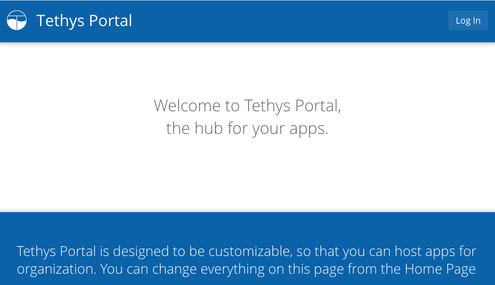

## **Step 2: Clone/Copy the GWDM Appliclation**

:::: warning
::: title
Warning
:::

If the Tethys server is running from the previous step, make sure to
quit the server with CONTROL-C before proceeding to the next step.
::::

1.  Create a directory (folder) in the home directly and name it (e.g.
    \"tethys_dev\"). In this directory, the GWDM app will be cloned from
    the following link: [https://github.com/BYUHydroinformatics/gwdm](https://github.com/BYUHydroinformatics/gwdm){:target="blank"}.

2.  On the right side of the repository, click on `Code` green box and
    then click on the button to copy the URL

3.  Bring up a terminal window and go to the directory just created by
    executing the following command.

    > ``` bash
    > cd tethys_dev
    > ```

    `tethys_dev` should be modified if the directory is named
    differently.

4.  The GDWM app will be cloned here. To clone the app, type the
    following:

    > ``` bash
    > git clone URL
    > ```

    Where URL is the URL that you copied to the clipboard. In other
    words, type `git clone` then paste the URL from the clipboard. When
    you are done, it should look like this:

    > ``` python
    > git clone https://github.com/BYU-Hydroinformatics/gwdm.git
    > ```

5.  To complete the installation, we need to install the app we just
    cloned. First, we need to be in the Tethys virtual environment. In
    the Command Line, type:

    > ``` bash
    > conda activate tethys
    > ```

    Next, make sure you are at the top level of the new directory you
    just created (e.g. tethys_dev). There should be a new
    directory/folder called `gwdm` and the folder should contain
    `setup.py`. Go to the `gwdm` directly by executing:

    > ``` bash
    > cd tethys_dev/gwdm
    > ```

    Finally, this command is used to install the app on your portal:

    > ``` bash
    > tethys install
    > ```

    To make sure that the app is installed on your local Tethys
    Platform, launch the Tethys portal by typing on the Command Line:

    > ``` bash
    > tethys manage start
    > ```

    Then, go to [http://127.0.0.1:8000/apps/](http://127.0.0.1:8000/apps/){:target="blank"} and the app should be
    displayed.

    > :::: note
    > ::: title
    > Note
    > :::
    >
    > The initial admin login ID and password is: Username: admin
    > Password: pass
    > ::::
    >
    > 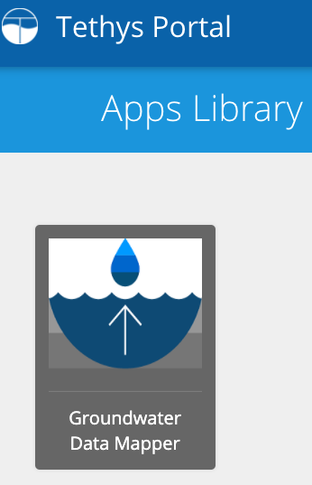

## **Step 3: Set Up Docker Containers**

1.  Create a new directory/folder in your home directory and name it
    `Thredds`. Make the Thredds directory public by typing in the
    Command Line:

    > ``` bash
    > sudo chmod -R 777 Thredds
    > ```

2.  Next, install Docker from [https://docs.docker.com/engine/install/](https://docs.docker.com/engine/install/){:target="blank"}.
    . Docker will be installed as an app on Mac. In the Command Line,
    type:

    > ``` bash
    > tethys docker init
    > ```

    This will initiate downloading necessary elements and may take
    anywhere from a few minutes to hours depending on the internet
    connection. After the Docker initializes, the Command Line will ask
    for several settings. For most of the cases, simply accept the
    defaults by hitting `Enter`.

    :::: note
    ::: title
    Note
    :::

    1.  For the password, put pass to keep it simple. If a different
        password is selected, that needs to be remembered as this
        password will be required in later steps.
    2.  For the Thredds container, it will ask "Bind the THREDDS data
        directory to the host?" To which you will respond "Y" for yes.
        The next option will ask you to specify the location. Respond
        with the file path to the Thredds directory that you created
        earlier.
    ::::

    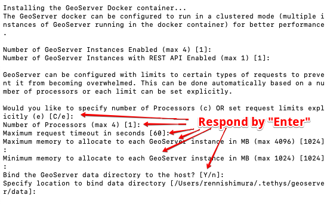

## **OPTIONAL: Set Up Portainer.io**

Portainer gives a detailed status and health check of the Docker
containers. In the Command Line, type:

> ``` bash
> docker volume create portainer_data
> ```
>
> ``` bash
> docker run -d  -p 9000:9000 --name=portainer --restart=always -v /var/run/docker.sock:/var/run/docker.sock -v portainer_data:/data portainer/portainer-ce
> ```

Go to localhost:9000 to set up the userID and the password. On the next
page, select \"Docker\" and complete the setting.

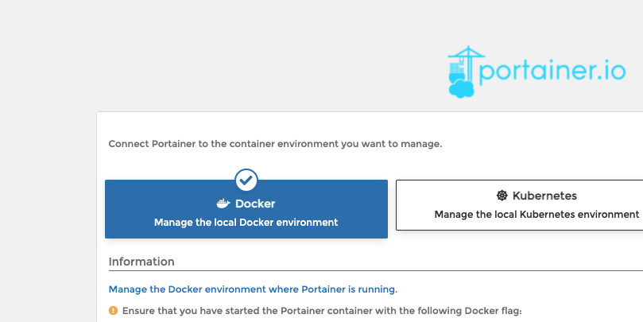

After the installation, Portainer should show up on Docker. Follow the
steps below and make sure all the containers are healthy and running
(you may have to start the new Tethys containers with the \"Start\"
button).

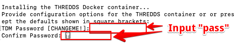

## **Step 4: Download PGAdmin 4 for Database Management**

Download PGAdmin ([https://www.pgadmin.org/](https://www.pgadmin.org/){:target="blank"). Download the macOS
version (or whatever operating system you are using).

Open the application and add a new server

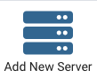

Name it as you desire (e.g. \"postgis_thethys_docker\"). Click the
\"Connection\" tab and enter the following settings:

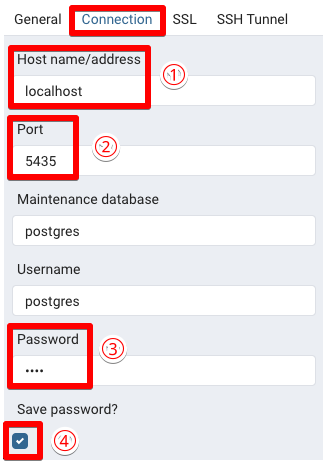

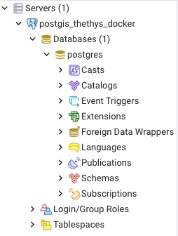

## **Step 5: Tethys Settings**

Now in the Command Line, run:

> ``` bash
> tethys syncstores gwdm
> ```

and

> ``` bash
> tethys manage start
> ```

Go to the Tethys homepage ([http://127.0.0.1:8000/apps/](http://127.0.0.1:8000/apps/){:target="blank") and click the
app icon. You should land on the page titled \"Change Tethys App.\"

1.  Click the **plus mark** under **PERSISTENT STORE DATABASE
    SETTINGS**.

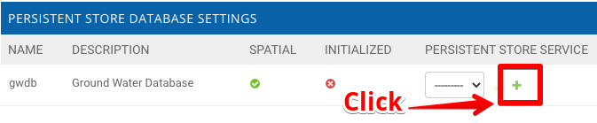

On the next page, set up the settings to:

> :::: note
> ::: title
> Note
> :::
>
> \- Name: Arbitrary Name (e.g. Postgresql) - Engine: PostgreSQL - Port:
> 5435 - Username: postgres
> ::::

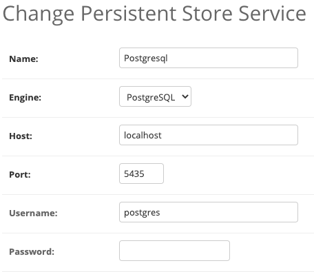

Now, save the settings.

2.  Add a Spatial Dataset Service (for GeoServer) and select it in the
    app settings

    > :::: note
    > ::: title
    > Note
    > :::
    >
    > -   Name: Arbitrary Name (e.g. geoserver)
    > -   Engine: GeoServer
    > -   Endpoint: [http://127.0.0.1:8081/geoserver/](ttp://127.0.0.1:8081/geoserver/){:target="blank"}
    > -   Username: admin
    > -   password: geoserver
    > ::::

    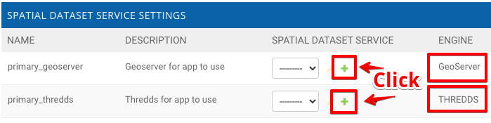

    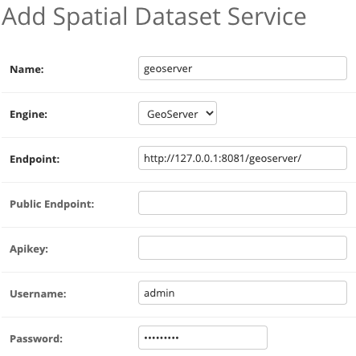

3.  Add another Spatial Dataset Service (for thredds) and select it in
    the app settings

    :::: note
    ::: title
    Note
    :::

    -   Name: Arbitrary Name (e.g. Thredds)
    -   Engine: THREDDS
    -   Endpoint: [http://127.0.0.1:8383/thredds/](http://127.0.0.1:8383/thredds/){:target="blank"}
    -   Username: admin
    -   password: pass
    ::::

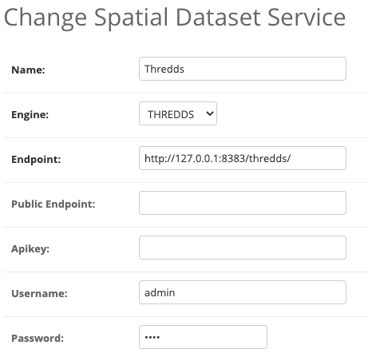

4.  Make a directory in your Thredds directory in
    **thredds/public/testdata** and call it **"groundwater"**. Add the
    file path to this new groundwater directory to the thredds file path
    in the app settings

    > ``` bash
    > tethys syncstores gwdm
    > ```

    Open up PGAdmin4 again to check that the database is initialized.
    Under Databases, **"gwdm_gwdb"** should now show up. Within
    gwdm_gwdb, if you select Schemas\>public\>Tables the different
    parameters should be visible (aquifer, measurement, well, etc.)

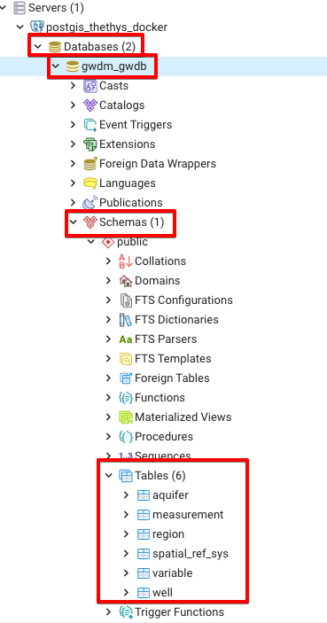

## **Step 6: Edit Thredds Files**

1.  Go into the thredds directory and open the "Catalog.xml" file with
    an editor (Pycharm, Notepad++, etc.)
    -   Uncomment the wms, wcs, and ncss service tags within the service
        section
    -   In the "datasetScan" tag, change the name attribute from
        `Test all files in a directory` to `All Datasets`
    -   In the "Filter" section towards the bottom of the file:

Remove one of the "include" tags and change the other one to say `<include wildcard=”*”/>`

:   -   Delete the "catalogref" tag at the very bottom

If you need help, the screenshot below shows what it should look like.

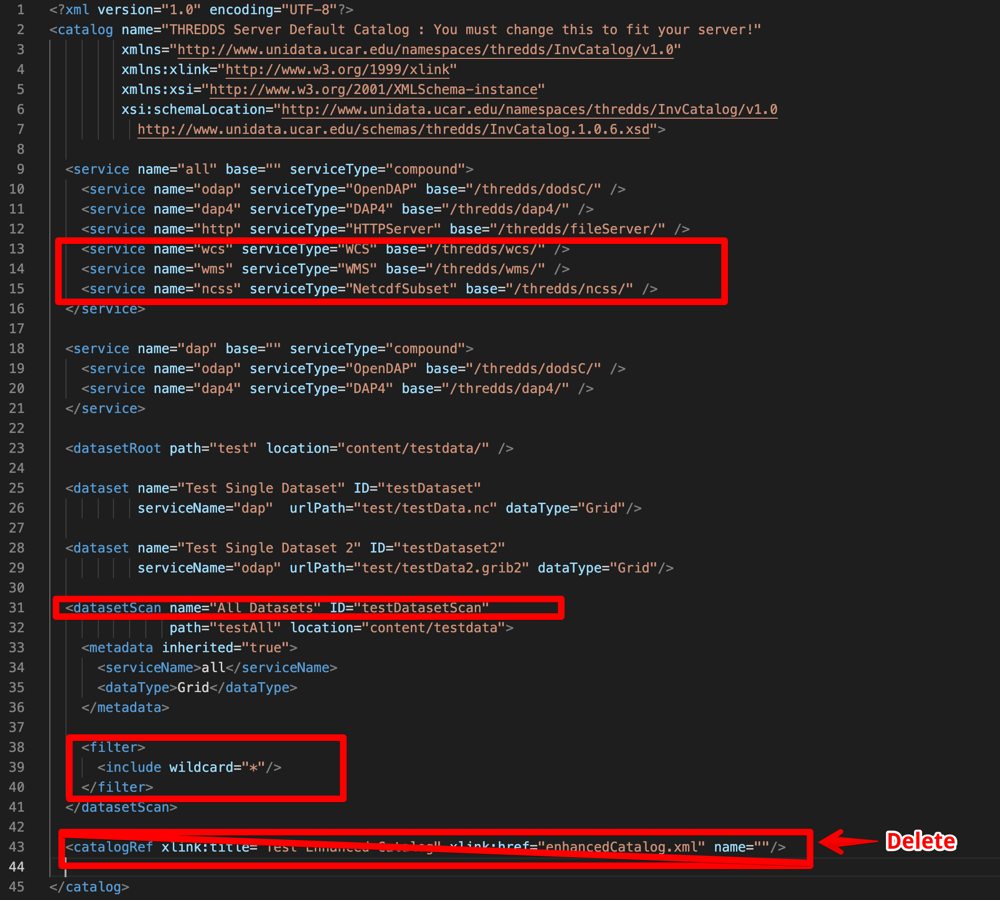

2.  Open the "threddsConfig.xml" file
    -   Uncomment the CORS tag and enable it to "true"

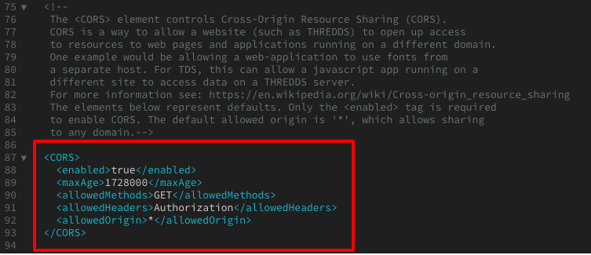

``` bash
<paletteLocationDir>/WEB-INF/palettes</paletteLocationDir>
```

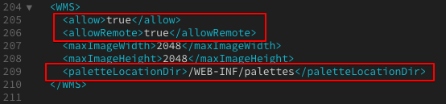

## **Step 7: Set Up GeoServer**

1.  Open GeoServer browser and log in (localhost:8081/geoserver)

**Add a new workspace:**

Go to "Workspaces" tab \> "Add New Workspace" link. Name it "gwdm"
(Namespace can be anything)

**Add a new store:**

Stores tab \> "Add New Store" link \> "Postgis" link. Select gwdm
workspace from dropdown and set:

:::: note
::: title
Note
:::

\- Name: postgis - Host: 172.17.0.1 - Port: 5435 - Database: gwdm_gwdb -
Schema: public - User: postgres - Password: pass

-   Save it
::::

\>Publish the Layers

Go to "Layers" tab \> "Add a new resource" link \> "gwdm:postgis" from
dropdown

> -   Click "Publish" for the region layer
> -   Under the "Bounding Boxes" section, click "Compute from data" and
>     "Compute from native bounds"
> -   Save it
> -   Repeat the process for the aquifer and well layers

::: admonition
Success

Now you can add data and begin using the app.
:::
