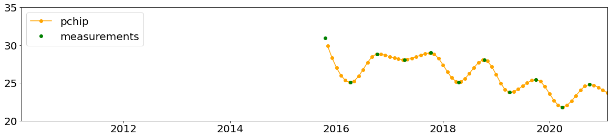
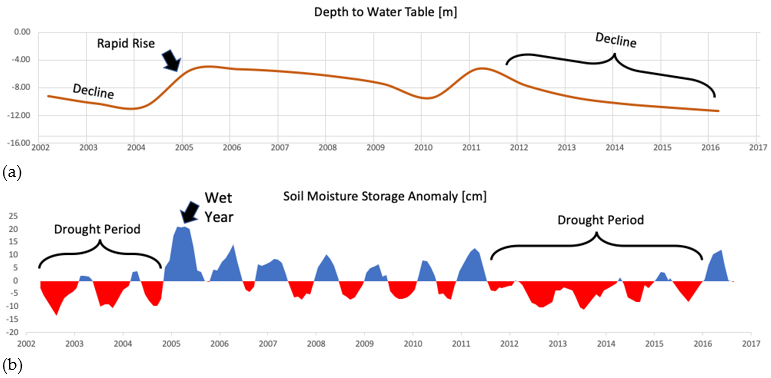
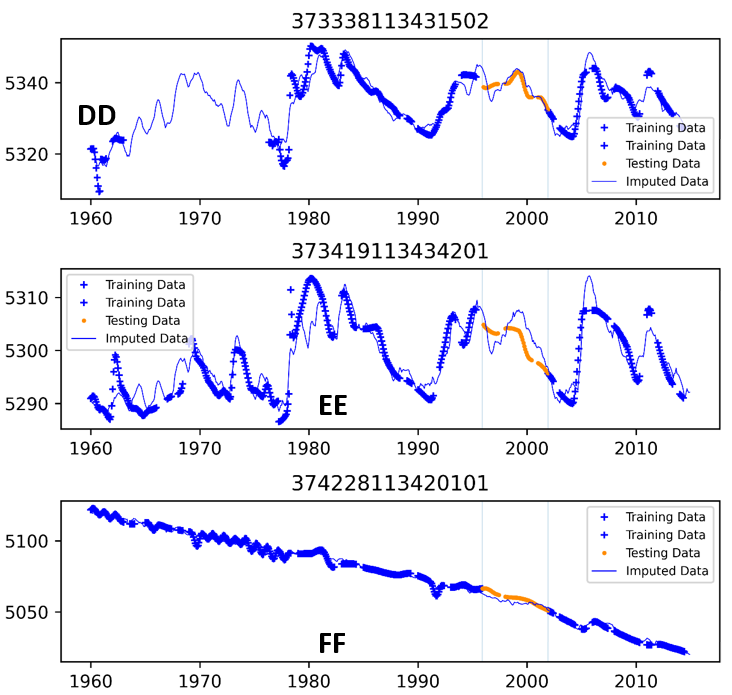

.. raw:: html
   :file: translate.html
   
**Groundwater Level Mapping**
=============================
**Introduction**
-------------------
In addition to visualizing well and measurement data, the GWDM app and associated tools can generate and display rasters of time varying water levels and time series of aquifer storage change. These groundwater maps are in the form of netCDF rasters at selected intervals (yearly for example) over a selected time range. They are generated using a multi-step process that involves imputing gaps in water level time series at wells using Earth observations and machine learning, spatial interpolation of water levels using kriging, and volumetic analysis of the raster results. While the app supports any kind of groundwater data measurements, the mapping tool is designed for water level data. When using the mapping tool, the user selects a start date and an end date and a time interval for the interpolation process. For example, one could choose start = 1980, end = 2010, step = 5 years and the algorithm would generate a raster for 1980, 1985, 1990, ... 2005, 2010. The rasters are compiled into a netCDF file that can then be uploaded and animated in the map interface. Also, the mapping algorithm calculates the volume between each pair of rasters and multiplies the volume by a user-specified storage coefficient to compute a chart of groundwater storage change vs time. This chart can be especially useful in determining if an aquifer is being used in a sustainable fashion as it can demonstrate groundwater depletion.

In previous versions of the GWDM app, this was accomplished using the Interpolation Wizard that was found in the admin control panel. In order to give the user the ability to monitor each step of the process, we have moved the mapping tool to a standalone Google Colab notebook (link below).

**Overview of Algorithm**
--------------------------
The final aquifer map will include a Water Table Elevation estimate for every point in your aquifer at any time step. Since it is impractical and near impossible to collect all that data, interpolation methods can be applied to fill in for data we do not have. Our interpolation algorithm can be split into two major steps. First, the temporal interpolation of individual well time series. Second, the spatial interpolation between those wells. Each of these is explained in greater detail below.
**Temporal Interpolation**
---------------------------
While some wells have a relatively complete dataset over the period of interest, it is very common to have large gaps in the data record. The goal of temporal interpolation is to create a complete time series for each well that can be easily compared to other wells. The final output of this step will be a timeseries with measurements every month during the entire period of interest. Some measurements are close enough together that it is easy to predict the value at the beginning of the month. This can be done using simple PCHIP interpolation. Some measurements are more difficult to predict. We estimate these values using machine learning.

**Simple PCHIP Interpolation**
~~~~~~~~~~~~~~~~~~~~~~~~~~~~~~
For reference, PCHIP stands for Piecewise Cubic Hermite Interpolating Polynomial. During this step we decide how close measurements must be to justify the use of PCHIP interpolation. We call this value the pad value. The image below shows an example results of PCHIP interpolation. In this example, the pad value was 365 days. Note that PCHIP only interpolates between measurements.
installation.

    
**Machine Learning**
~~~~~~~~~~~~~~~~~~~~
For longer periods of interpolation that are harder to predict, we use machine learning to fill in the missing data. The machine learning finds correlations between Earth observations and water level measurements and then uses data imputation to fill in the gaps. For example, groundwater levels generally rise during wet periods due to increases recharge and decreased pumping. Alternately, water levels drop during dry periods due to reduced recharge and increased pumping. The following charts illustrate this relationship using soil moisture anomaly from the Global Land Data Assimilation System (GLDAS) model.

The machine learning algorithms use these correlations to predict missing water levels in gaps in the water level time series. The imputation is performed using a novel multi-linear regression (MLR) algorithm called Extreme Machine Learning (ELM) to impute missing data for infrequently sampled wells. The ELM is trained with water levels and the time-varying Palmer Drought Severity Index (PDSI) for the region in question. Sample imputation results are shown below.

**Spatial Interpolation**
~~~~~~~~~~~~~~~~~~~~~~~~~~
Once the time series are complete, the time series curves for each well are sampled at the selected dates and spatial interpolation is performed to build the rasters. The algorithm applies GSLIB Kriging code to generate rasters user specified time steps. For the kriging algorithm, we auto-fit a variogram to the data in the aquifer based on the size of the aquifer.

To learn more about these methods, see the papers published in `Remote Sensing <https://www.mdpi.com/2072-4292/12/12/2044>`_ and `Environmental Modelling & Software journals <https://www.sciencedirect.com/science/article/pii/S1364815220301997?via%3Dihub>`_. 

**Water Level Mapping Google Colab Notebook**
----------------------------------------------
To launch the mapping tool, please click on this button. The notebook will open in a new tab. 

.. raw:: html

    
    
   
To run the water level mapping algorithm, you will first need to prepare your data. The algorithm requires three input as described in the following table. These are the same files (same content and format) that you would use to upload your original data to the GWDM mapper to visualize your wells and water level measurements. The only difference is that the aquifer file should only contain a single aquifer, while you could upload multiple aquifers at once to the GWDM app.
