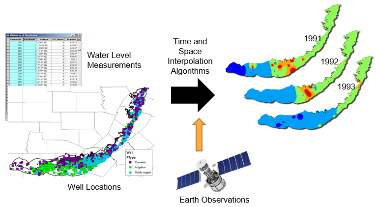
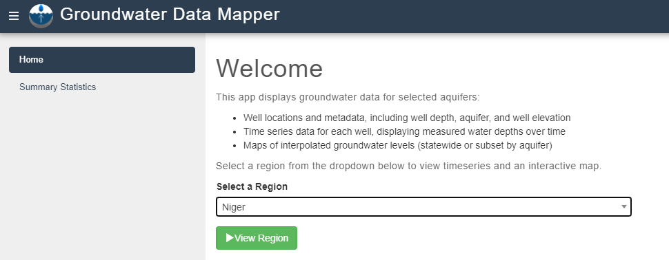
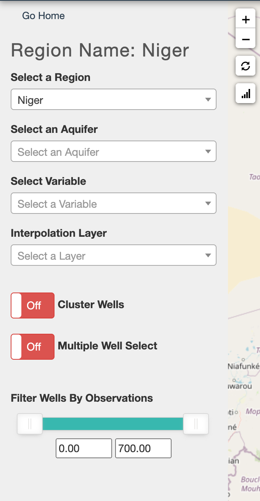
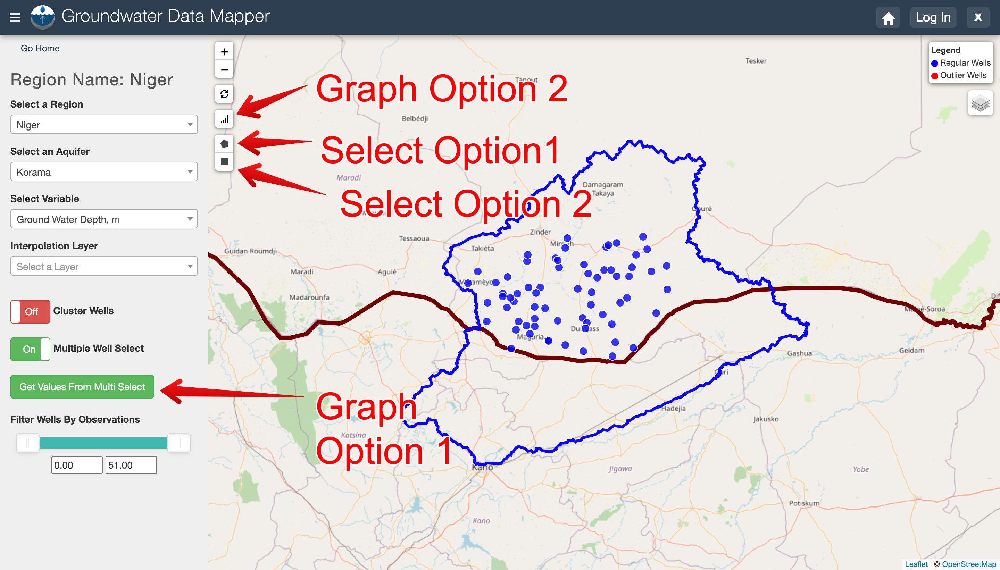
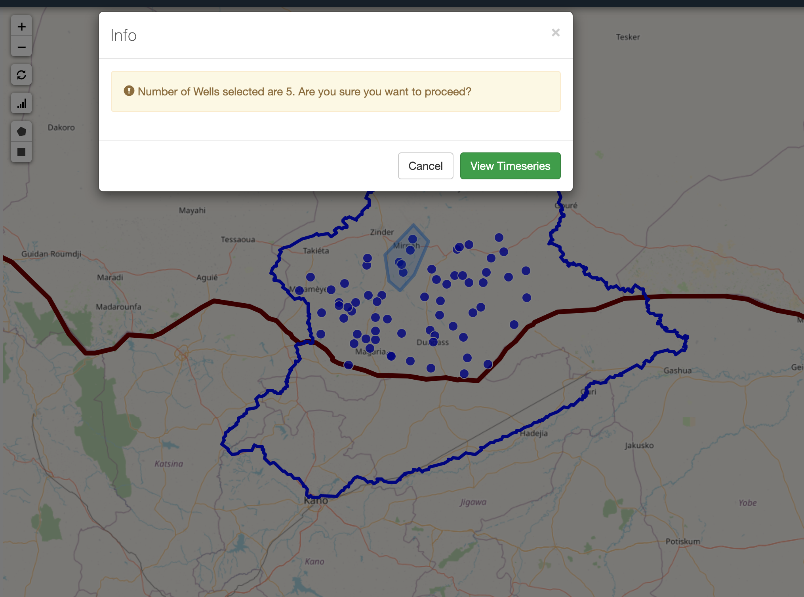
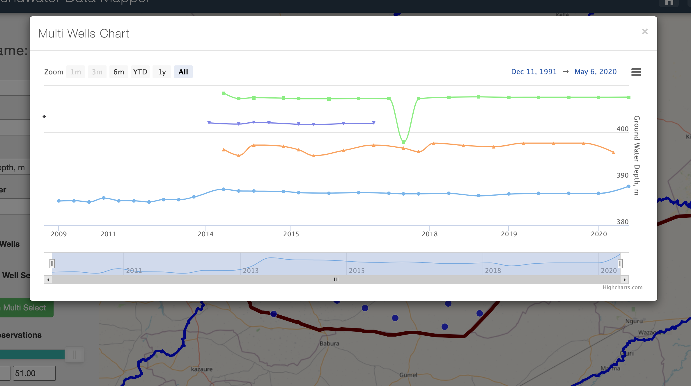
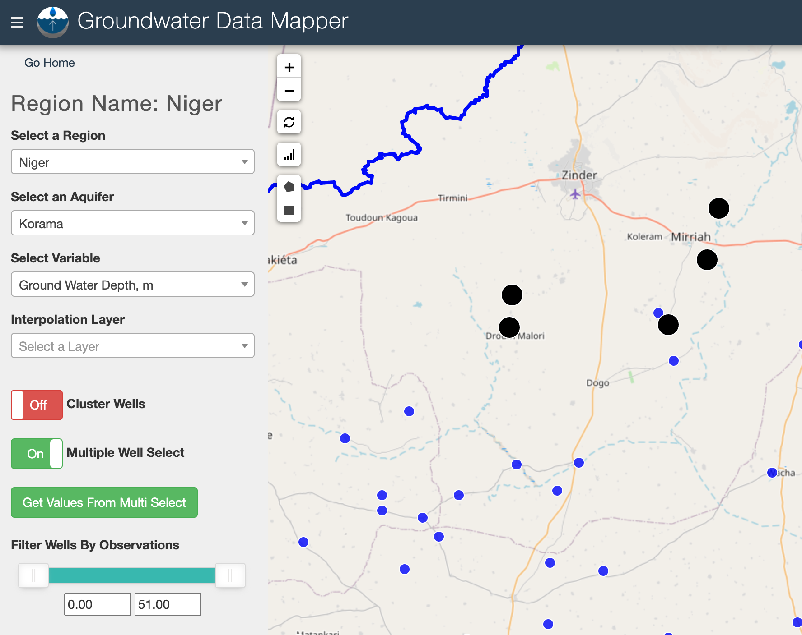
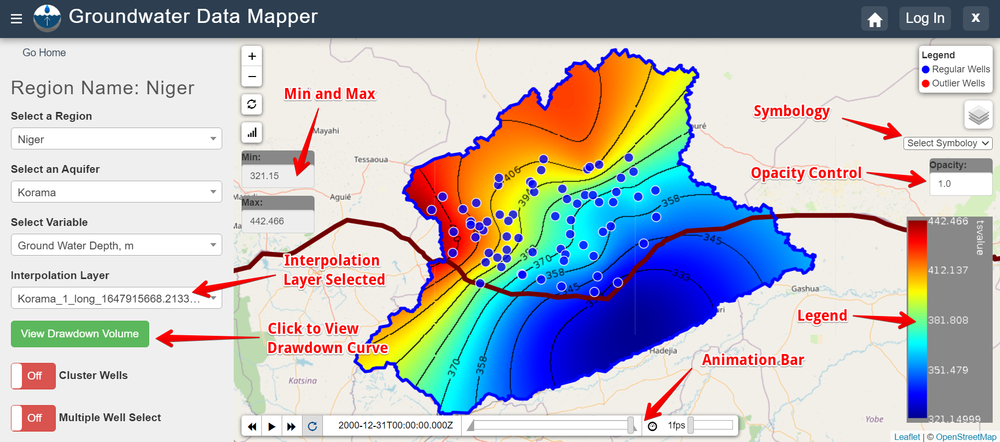
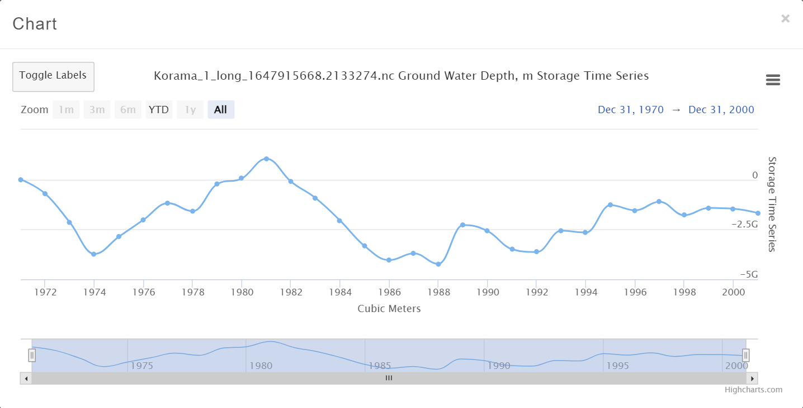
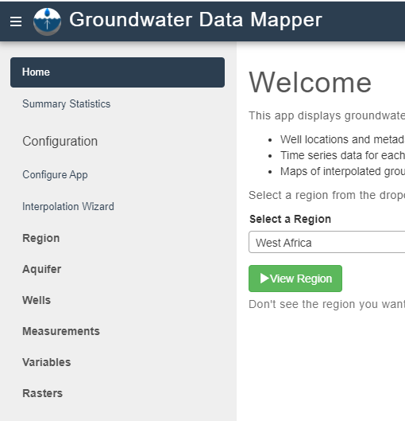

{{ include_file('docs/translate.html') }}

# **Overview**

Water managers in Western Africa and around the world face the daunting
task of managing freshwater resources in the face of increased demand
from industry, agriculture, climate change, and population growth. As
surface water resources become fully allocated, groundwater is
increasingly targeted to make up surface water deficits, particularly
during periods of drought. As a result, many of our aquifers are not
being managed in a sustainable fashion, resulting in reduced water
quality, land subsidence, increased pumping costs, and in some cases,
the complete exhaustion of an aquifer and the loss of groundwater as a
buffer during times of drought.

## **Mapping Algorithm**

{.align-right}

Even when water managers have access to large data sets of historical
groundwater level measurements, at any individual well these
measurements often exhibit significant time gaps. Aggregating and
synthesizing these well measurements to provide information that
supports a holistic assessment of aquifer level sustainability can be a
challenging task. In partnership with NASA SERVIR, we have developed a
series of algorithms that use these existing well measurements combined
with Earth Observation data to analyze changes in water tables and
characterize aquifer storage over time. Our approach involves collecting
data describing well locations and any historical water level
measurements in an aquifer. To evaluate aquifer behavior, we need to
impute missing data at each well location so that we have data at each
time step for analysis. To impute (or estimate) missing measurements at
each well, we use a machine learning approach that trains models to use
Earth observation data. Using this approach, we generate a time series
for each well and use these data to spatially interpolate the water
table at each time step.

These interpolated water table maps can be used to evaluate the
sustainability of the aquifer by looking at the changes to aquifer
storage over time. We have shown that our approach can deal with gaps
resulting from long periods with no measurements at wells. Our machine
learning algorithms build correlations between existing water level
measurements and Earth observations such as water storage changes from
the NASA Gravity Recovery and Climate Experiment (GRACE) mission, soil
moisture from the Global Land Data Assimilation System (GLDAS), or the
Palmer Drought Severity Index (PDSI). These machine learning methods
have shown to be remarkably accurate for data imputation and
extrapolation. The product of this process is a series of time-varying
rasters that can be animated to allow water managers to visualize how
the water levels are changing over time and where the aquifer is being
stressed. The rasters can also be analyzed to assess the change in
aquifer water volume or storage over time -- a key indicator of aquifer
health and sustainability.

## **Tethys Application**

We have incorporated our groundwater level mapping algorithms in a
simple, easy-to-use web application created using the Tethys Platform,
developed in our hydroinformatics laboratory. In addition to the water
level mapping, the system provides a powerful online database of
historical groundwater data where users can zoom in to areas of
interest, select wells, and view the historical water level record and
meta-data about each well.

The GWDM app can be accessed in the following locations:

-   **Servir West Africa Portal**: Official Tethys portal hosted by the
    SERVIR Science Coordination Office (SCO) for the West Africa Hub
    (<https://tethyswa.servirglobal.net/apps/>).
-   **BYU Portal**: A Tethys portal hosted by Brigham Young University
    for all completed apps (<https://tethys.byu.edu>).
-   **GEOGloWS Portal**: A portal associated with the GEOGloWS
    organization (<https://apps.geoglows.org/apps/>).
-   **INDRHI GEOGloWS Portal**: A Tethys portal used by INDRHI, the
    national institute for hydraulics in the Dominican Republic
    (<https://indrhi.geoglows.org/apps/>).
-   **GEOGloWS Portal**: A portal associated with the GEOGloWS
    organization (<https://apps.geoglows.org/apps/>).

## **Regions, Aquifers, and Well Data**

For any of the portals, you can access the app by clicking on the
Groundwater Data Mapper icon. Once you are in the app, you will see the
landing page:

{width="970px" height="378px"}

Select a region and then click on the **View Region** button. In the
GWDM tool, data are first organized by region and then by aquifer. When
you click on the View Region button, you will see a map of the selected
region and the corresponding aquifers. To view well data, you need to
select an aquifer. Once you select an aquifer, the app will zoom in on
the aquifer and display all wells associated with the aquifer. The well
data consists of two parts:

1. Well locations 
2. Historical observations at the wells.

The observations are typically water levels that can be represented
either as depth to the water table or water table elevations, but any
variable is supported and could include water quality data. The regions,
aquifers, wells, and measurements are imported through an admin
interface that is described in more detail in the subpages associated
with the GWDM on this website.

## **Controls**

On the left side of the map, you will see a set of controls:

{width=400}

**Select an Aquifer**: This is used to switch between aquifers in the
region as described above.

**Select Variable**: The well data may have historical measurements of
different types. You can use this to select the type you'd like to
explore.

**Interpolation Layer**: If the interpolation algorithm has been used to
generate aquifer maps, the resulting maps are listed in this drop-down
list. These are netCDF files that are displayed as color contours in the
map window on the right. See the section below on displaying rasters.

**Cluster Wells**: For aquifers with large numbers of wells, this
feature can be used to simplify the display by grouping sets of adjacent
wells into clusters. You can see the individual wells by zooming in or
by clicking on the clusters.

**Multiple Well Select**: This is used to select and display time series
plots for multiple wells. See the section below for more details.

**Filter Wells by Observations**: These controls show the min and max
number of measurements associated with individual wells in the aquifer.
By changing the two values, you can filter which wells are displayed.
For example, to only show wells that contain at least one measurement,
change the min value on the left to something other than zero.

**Reset**: The reset button is located just above the graphing button to
the right of the control panel and is used to return to the region's
home

To explore the well data, you can click on individual wells to see
metadata about the well. If the well contains historical measurements,
they are plotted as a time series graph at the bottom of the screen.

## **Selecting and Displaying Multiple Wells**

It may be helpful to compare wells within the same aquifer that may not
necessarily fall under the same cluster groups. One would need to select
which variable to compare before activating the Multi-Well Select. To
activate this command, simply click on the button which will then turn
green and three more options will be added to the screen. Here is a
picture of all the options that will be available once the Multiple Well
Select is activated:

{width=800}

**Select Option 1**: This select method allows the user to draw a
polygon by clicking around the wells interested in. This option allows
one to draw any closed polygon around any wells one wishes to visualize.

{width=800}

Once the polygon created is closed, a message box will appear giving you
an option to view the time series. When you click on the view time
series, a Multi Wells Chart will appear on your screen comparing the
time series of the selected wells. If you click cancel, you can still
visualize your selected wells by clicking on Graph Option 2 whose icon
looks like a bar graph.

{width=800}

Here is an image of the results from our previous selection. Notice that
the chart only shows available data and skips any missing data.

{width=800}

**Select Option 2**: This option is similar to the first option. The
only difference is that this shape is fixed to be a rectangle. You may
change the size but not the type. It follows the same procedure as the
first option.

**Graph Option 1**: This will graph individually selected wells. This is
done by individually clicking on individual wells, which will turn black
upon selection. This is the only way to graph the selected wells.

Here is a rendering;

{width=800}

## **Displaying Rasters**

Once you have created an interpolation layer and selected that layer
from the control panel on the right, a new set of controls will appear.
The figure below points out each of those controls and the following
paragraph explains each of them.

{width=800}

**Animation Bar**: You can slide the bar to move through the time
interpolation or you can hit play to run through the animation
automatically. You can change the speed of animation by changing the
frames per second (fps). You can also adjust the triangular ends on the
slide bar, to animate over a shorter period.

**Min and Max**: Displays the maximum and minimum water table elevation
values for the entire aquifer during the entire interpolation time
range.

**Symbology**: There are several preloaded symbology or raster coloring
options which you can choose from the dropdown menu.

**Opacity**: Changing the opacity of the raster may be helpful if you
wish to see some of the features on the base map.

**View Drawdown Volume**: The drawdown volume graph converts the water
table elevations over time to an increase or decrease in total volume in
the aquifer. An example of the drawdown volume curve is included below.

{width=800}

## **Admin Control Panel**

There is also an admin control panel that is used to import and manage
the data used by the app and to perform interpolations:

{width=800}

## **Documentation and Tutorials**

The table of contents can be used to explore a set of documentation and
tutorials associated with the GWDM. The sections are as follows:

*Data Preparation*. This section describes how the data are organized in
the GWDM and how to format your data before importing the data into the
app.

*Support Scripts*. This section describes a set of Python scripts that
can be used to process, format, and prepare your data. For example, one
of the scripts can be used to generate ground surface elevations using
global DEM data if your wells do not have elevation data.

*Importing Data*. Once your data are organized into properly formatted
input files, this section describes how to import the data into the app.

*Mapping*. This section describes the interpolation algorithms and shows
how to generate time-varying rasters of your groundwater data for
display and animation.

*Installation*. This section describes how to install the GWDM app in
your own Tethys portal.
