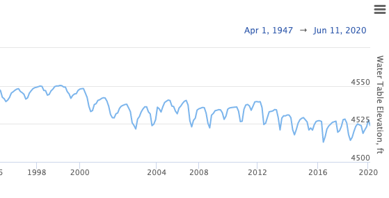

.. raw:: html
   :file: translate.html

**Data Preparation (API)**
=========================

**Introduction**
---------------

Before importing data into the GWDM app, the following data content needs to be collected and prepared\:\

  * Region Boundary
  * Aquifers
  * Well locations
  * Measurements (Time Series Data)
  
A region is typically a state, country, or water management agency boundary and represents the top of the data hierarchy. In one region, there may be one or more aquifers in which wells are located. Each well may have time series data in one or multiple files that show historical trends of groundwater data such as water table elevations, water quality, etc. The following diagram graphically illustrates the relationship of the different data components:

This page will walk you through how to prepare the appropriate files needed to import data into the app and provide links to complementary tools designed to aid in this data preparation process.

**Regions & Aquifers**
---------------------
The first step of organizing groundwater data in the GWDM app is uploading region and aquifer files where the wells are located. In the app, region is the first "filter" that users see on the landing page. Data are then organized by aquifer in the next page.

Region and aquifers files have to be one of the following data types:

   * Shapefile (.shp, .shx, and. dbf are required)
   * GeoJSON file (.geojson)
 
In the examples used on this page, the state of Utah (USA) was used as a region boundary in a shapefile and Utah's major aquifers were prepared in a .geojson file.
When exporting shapefiles from a utility such as Esri ArcGIS or QGIS, the shapefile should be exported as a 2D object, not a 3D object (no Z coordinate). This is because the PostGIS database used to store the objects in the GWDM only supports 2D shapes. Shapefiles with Z coordinates will result in an error message when importing to ArcGIS. In our experience, shapefiles and GeoJSON objects exported from QGIS are more likely to import correctly than shapes exported from ArcGIS.

**Region (State Boundary)**:
---------------------
For this example, QGIS was used to export the region boundary (the state of Utah) as a shapefile. You can often find regional shapefiles on the internet. Regardless of where you get your shapefile, the exported files should consist of multiple files as seen below.

Also, make sure the shapefile does NOT include Z coordinates as this will generate an error when you attempt to import the file. The PostGIS database used by the GWDM to store the region and aquifer boundaries only supports two-dimensional shapes.

**Aquifer**:
------------
The aquifers in your region will also need to be organized in either a geojson file or a shapefile. The attribute table for the aquifer file has two fields (columns) that are required to upload the file to the app: an aquifer name representing the unique name of the aquifer and an **aquifer ID**, a unique integer ID.

+---------------+-----------+-------------------------------------------------------------+
| Field         | Type      | Description                                                 |
+===============+===========+=============================================================+
| Aquifer  Name |Text       | The names should uniquely describe the aquifers             |
+---------------+-----------+-------------------------------------------------------------+
| Aquifer ID    |  Numeric  | The integer IDs should be unique (not have duplicate values)|
+---------------+-----------+-------------------------------------------------------------+

**Well Locations File**
------------------------
Well locations are organized in CSV files where each row represents a well location and the columns represent well attributes. These typically can be exported from Excel or from a well database.

Wells are organized by aquifers in the app. There are two ways to prepare well locations files.

1. Create a single CSV file with all wells and assign each well an aquifer ID corresponding to the aquifer it is located in. This allows the GWDM app to match the aquifer ID attribute from the well location file to the aquifer ID that was input with the aquifer polygons in the previous step. This allows you to import all of the wells associated with your region in a single step. However, it does require that you have aquifer IDs associated with your wells. If you do not have Aquifer IDs, you can use one of the support scripts we have provided to automatically generate the IDs based on the aquifer polygon files and the well coordinates.

2. Create a separate CSV file that contains only wells belonging to a single aquifer. This method does not require an aquifer ID as all of the wells are imported to an assigned aquifer. With this method, you create multiple well files, one per aquifer, and then import the wells one at a time. Each time you import the wells, you explicitly select the aquifer polygon the wells should be assigned to.

A well location file must include the well coordinates (latitude and longitude in a decimal degree format), well names, and well IDs. If you are using method #1 described above, an aquifer ID field is also required.

The required fields (columns) for a wells file are:

+--------------------------+----------------+-----------------------------------------------------------------------------------------------------------------------------------------------------------------------------------------------------+
| **Field**                | **Type**       | **Description**                                                                                                                                                                                     |
+--------------------------+----------------+-----------------------------------------------------------------------------------------------------------------------------------------------------------------------------------------------------+
| Latitude                 | Numeric        | Latitude must be input in a decimal degree format.                                                                                                                                                  |
+--------------------------+----------------+-----------------------------------------------------------------------------------------------------------------------------------------------------------------------------------------------------+
| Longitude                | Numeric        | Longitude must be input in a decimal degree format.                                                                                                                                                |
+--------------------------+----------------+-----------------------------------------------------------------------------------------------------------------------------------------------------------------------------------------------------+
| Well name                | Text or Numeric| This is a text string or number used to identify the well.                                                                                                                                          |
+--------------------------+----------------+-----------------------------------------------------------------------------------------------------------------------------------------------------------------------------------------------------+
| Well ID                  | Text or Numeric| Well ID has to be a unique value and must not have duplicates within an aquifer. There can be duplicate well IDs in different aquifers (i.e. There can be the same well ID in different aquifers)  |
+--------------------------+----------------+-----------------------------------------------------------------------------------------------------------------------------------------------------------------------------------------------------+
| Ground Surface Elevation | Numeric        | OPTIONAL: This field only serves as a metadata purpose.                                                                                                                                             |
+--------------------------+----------------+-----------------------------------------------------------------------------------------------------------------------------------------------------------------------------------------------------+
| Aquifer ID               | Text or Integer|If a file contains wells from multiple aquifers, this field is mandatory.                                                                                                                            |
|                          |                |OPTIONAL if a file only contains wells from a single aquifer. See the description above for the two methods for importing well locations.                                                              |
+--------------------------+----------------+-----------------------------------------------------------------------------------------------------------------------------------------------------------------------------------------------------+

This is a sample well locations file:

**Measurements File**
--------------------
A measurement file is a CSV file containing the groundwater data measurements. Each measurement has a date, a data value, and a well ID that relates the measurements to the corresponding well. An aquifer ID column is optional depending on how the measurement file is prepared. Like a well locations file, there are two ways to prepare a measurement file.

        1. Create a single CSV file with all wells and groundwater measurements and assign each measurement/well an aquifer ID corresponding to the aquifer it is located in. This allows having the same well IDs from different aquifers in a single file (i.e. There can be wells with the same well IDs if they are located in different aquifers).
        This method allows you to import all of the measurements and wells in a single step. However, it does require that you have aquifer IDs associated with your measurements/wells. We also provided the support scripts to automatically format the uploading file with the well and aquifer IDs.
        
        2. Create a separate CSV file that contains only measurements/wells belonging to a single aquifer. This method does not require an aquifer ID as all of the measurements/wells are imported to an assigned aquifer. With this method, you create multiple well files, one per aquifer, and then import the measurements/wells one at a time. Each time you import the measurements/wells, you explicitly select the aquifer polygon the wells should be assigned to.
        In the GWDM app, the measurements associated with a well can be displayed as a time series curve as shown below. Measurements are also interpolated in time and space using the Mapping Google Collab Notebook to created time-varying rasters that can be animated or used to compute changes in aquifer storage vs time.
        

The required fields (columns) for a measurements file are:

+-----------------------+----------------+---------------------------------------------------------------------------------------------------------------------------------------------+
| Field                 | Type           | Description                                                                                                                                 |
+=======================+================+=============================================================================================================================================+
| Well ID               | Numeric        | This well ID should be related to one of the well ID values defined in the Well Locations file described above.                             |
+-----------------------+----------------+---------------------------------------------------------------------------------------------------------------------------------------------+
| Date                  | Date           | The date that the measurement was taken. The dates can be in almost any format*.                                                            |
|                       |                | When the measurements are imported, the user has the option to define the date format so that the dates are properly interpreted.            |
|                       |                | *The Unix Epoch begins in 1970, so any dates before 1970 will need to be 4-digit years; otherwise, they will be converted to the next       |
|                       |                | century (e.g. 1/1/69 will be converted to 1/1/2069; 1/1/1969 will remain 1/1/1969)                                                          |
+-----------------------+----------------+---------------------------------------------------------------------------------------------------------------------------------------------+
| Measurement(s)        | Numeric        | This column contains the actual measurements (water table elevation, depth to groundwater, water quality, etc). You can have one or multiple| 
|                       |                | data columns.                                                                                                                               |
+-----------------------+----------------+---------------------------------------------------------------------------------------------------------------------------------------------+
| Aquifer ID            | Text or Integer| This field is optional if all the measurements are from a single aquifer. This field is required if the uploaded files contain              |
|                       |                | measurements/wells from multiple aquifers. This aquifer ID should be related to one of the aquifer ID values defined in the Well Locations  |
|                       |                | file described above.                                                                                                                       | 
+-----------------------+----------------+---------------------------------------------------------------------------------------------------------------------------------------------+

This is a sample measurements file. Note that a measurements file can contain extra fields or columns. These columns are ignored when the data are imported. The data import process allows the user to designate which columns contain the required data. In this example, the only fields imported are Well_ID, Date, and WTE (water table elevation). The other fields are ignored. When preparing the measurements file, one should be careful to only include measurements associated with wells that have already been uploaded into the GWDM.

.. image:: images_dataprep/times_series_table.png

**Support Tools**
-----------------
Collecting, filtering, and formatting well and measurement data can be a complicated process, especially with large datasets. To assist in this process, we have created a set of Python scripts that aid in the generation of ground surface elevations (GSEs), obtaining existing well data from USGS, adding Aquifer IDs, and other formatting options. Each script is contained within a Google Collaboratory notebook. For more information regarding these scripts, go to the Support Scripts page. The scripts include tools for the following tasks:

     * Ground surface elevations are necessary to convert depth-to-water-table measurements to water table elevations. If your wells do not include ground surface elevations, the elevations can be sampled from a 30-meter DEM using the **Elevation Generator Tool**.

     * For locations in the United States, both well locations and measurements can be downloaded directly from the USGS NWIS database using the **NWIS Data Retriever Tool**.

     * You can assign aquifer names and IDs to wells, calculate water table elevations from depth to water table measurements, and clean up your data with other formatting options using the **Data Formatting Tool**.
     
**Summary**
----------
In summary, the app organizes aquifers, wells, and measurements in the relationship presented below under a region. Note how the various feature IDs are used to create relationships between regions, aquifers, wells, and measurements.

