.. raw:: html
   :file: translate.html
   
**Importing Data**
===================
 
**Introduction**
----------------
To demonstrate the data import process, an example set of data has been provided. Download and unzip the attached files or organize your own files to follow along.
`Download API Test Files <https://github.com/BYU-Hydroinformatics/gwdm/blob/ReadtheDocs-Documentation/docs/source/test_files/SupportScriptFileSet.zip>`_

**Add Region**
---------------
First, we must add a region. To do this, navigate to the main landing page (if you are not logged in with admin privileges, you will need to first obtain these credentials). Select the region tab on the left, then click on the **Add Region** link on the dropdown.

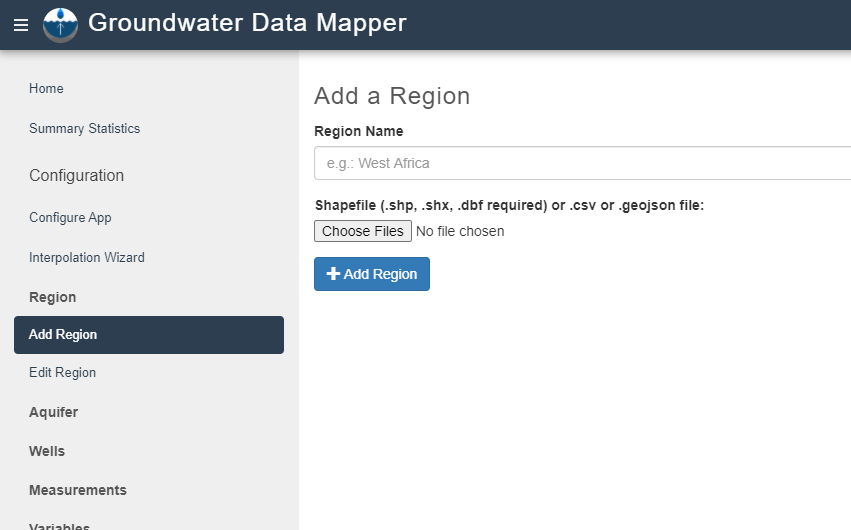
Type in the name of your region and click the Choose Files button to open a file browser. From there you can select a shapefile set, a csv, or a geojson file. The example file in this demo is a set of shapefile files for the Utah state boundary. Note that shapefiles require .shp, .shx, and .dbf files, although .prj files are also good to include.

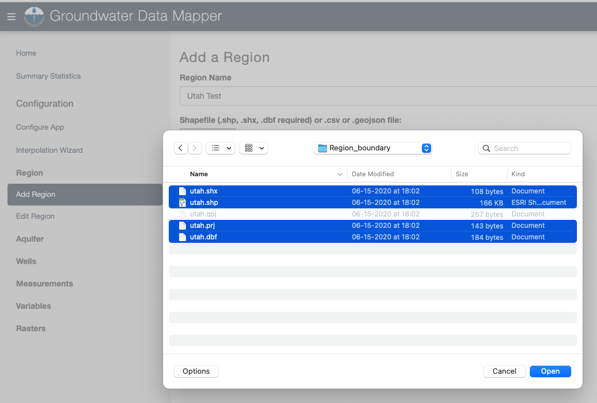
To ensure that your region was loaded properly, you can go to the **Edit Region** tab and click on the **View** icon for your region. This will display your region boundaries on a map. From this page, you can also edit the name of the region or delete a region using the appropriate icons.

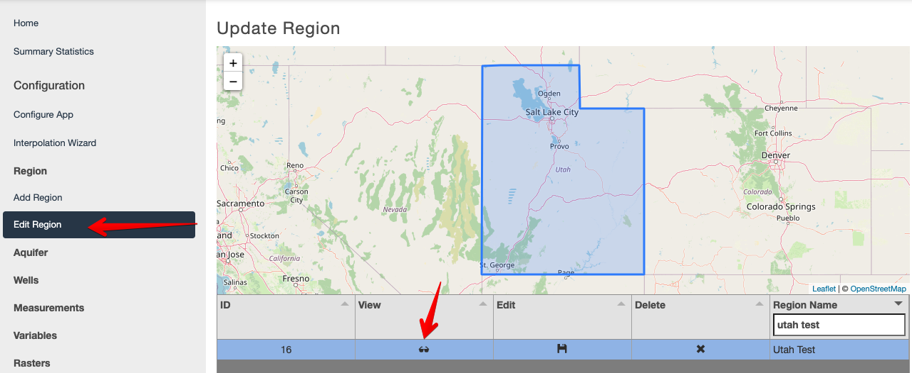

**Add Aquifer**
-----------------
Next, we will add the aquifers. To do this, we will follow a similar process to that of adding a region. First, we select the region where the aquifers are located. The dropdown list will display all previously uploaded regions.

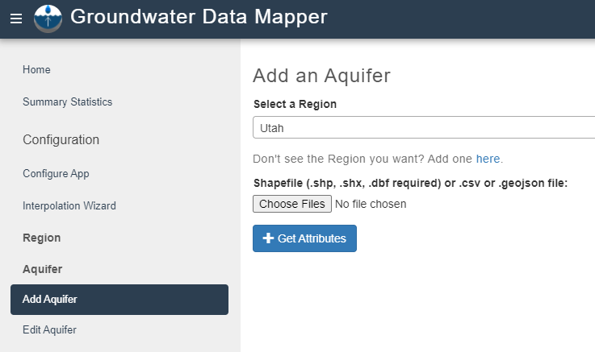
After selecting the region, a shapefile must be loaded. This time, we will use a geojson file type that contains aquifers in Utah.

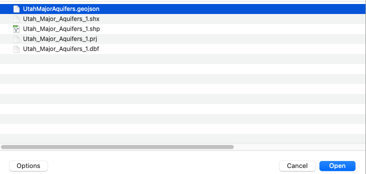
Once the file is added, we click **Get Attributes** to define the aquifer name and ID. An aquifer name and ID should be specified for each aquifer in the file. In the case of the example Utah file, the appropriate attributes are *Aquifer_Name* and *AquiferID* (note that not all files will have intuitive names for these attributes). Finally, we add the aquifer with the **Add Aquifer** button. Once the aquifer(s) are loaded, they can be viewed, edited, or deleted on the **Edit Aquifer** tab (editing an aquifer includes an ability to edit its aquifer ID; however, this ID is used to connect wells to aquifers, so be careful with this capability).

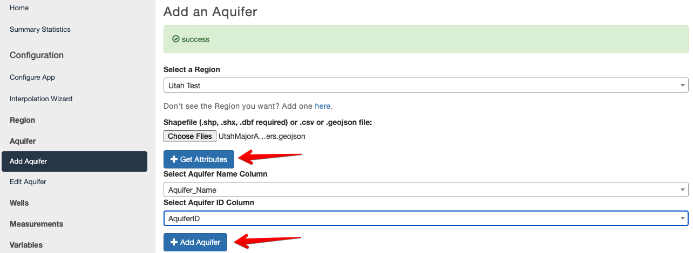

**Add Wells**
--------------
Next, we will add the wells using the **Add Wells** command in the Wells section. These wells have already been assigned to their respective aquifers, so we can add them all at once. If you would like to add wells to a single aquifer at a time, pre-assigning aquifer IDs is unneccessary.

To add a list of wells, we select the region of interest. Since we have pre-assigned aquifer IDs, we will not select a single aquifer from the list; rather, we will leave the field blank. This time, we will use a csv file (although shapefiles can also be used). We again use the **Get Attributes** button to retrieve the column headers from the file. The **Wells Wizard** will automatically open up, wherein we can select the columns for latitude, longitude, aquifer ID (not necessary if a single aquifer was selected previously), well name, well ID, and ground surface elevation (GSE). For this example file, the appropriate headers are lat_dec, long_dec, AquiferID, Well_Name, Well_ID, and GSE, respectively. Finally, we click the **Add Wells** button to add the wells to the app.

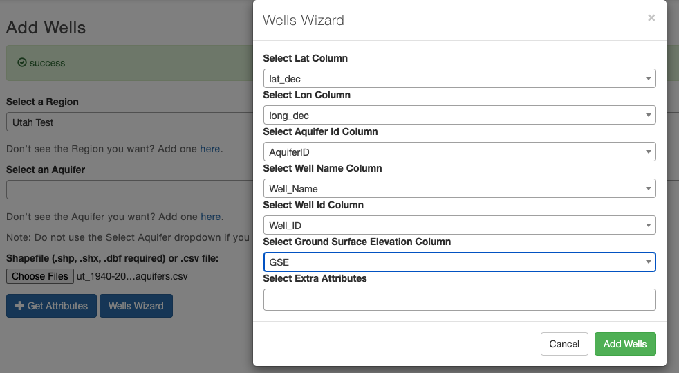

Again, the wells can be viewed or deleted from the **Edit Wells** tab. All wells in an aquifer can also be deleted en masse using the **Delete Wells by Aquifer** tab.

**Add Measurements**
--------------------
Finally, we can add the measurements. Before we can add a measurements file, we need to ensure that our variable is defined. The app is variable agnostic, meaning any variable can be defined and used to label measurements that are uploaded. Variables can be defined using the **Add Variable** tab under **Variables**. A variable name, units, and description needs to be specified and the variable is added with the **Add Variable** button.

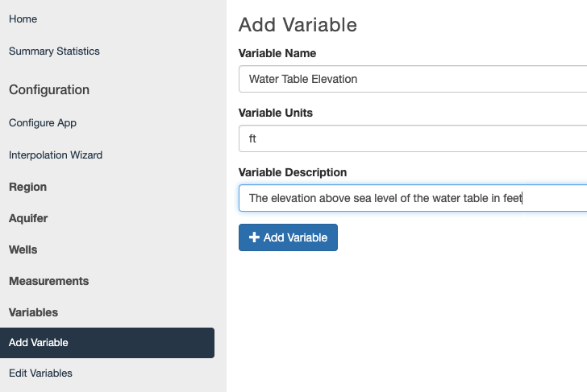

Measurements are added with the **Add Measurements** tab under **Measurements**. The region and variable that we defined earlier can be selected from the respective dropdown menu. However, just as with the wells, measurements can be added to all aquifers (with AquiferID defined for each measurement) or to an individual well (using the Select an Aquifer dropdown menu).

Our example file includes measurements of water table elevation from wells across Utah, so we will leave the *Select an Aquifer* option blank. We assign the attributes to the appropriate column using the **Get Attributes** button and **Measurements Wizard** window. The headers for our example file are AquiferID, Well_ID, Date, and WTE, as seen below. The date format must be in the Python Date Format, which can be referenced at: https://strftime.org/. A list of common date formats can be found below (to determine which date format your file uses, it is strongly recommended to open your file in a text editor, as MS Excel often reformats data). The **Add Measurements** button will add the measurements to the wells in the region.

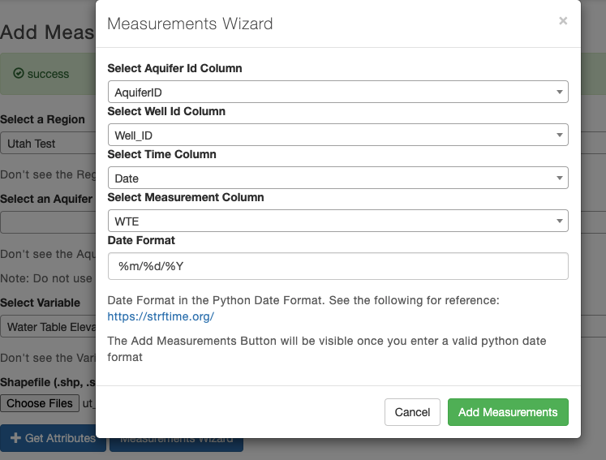

.. list-table:: Common Python Date/Time Formats
   
   *  - **Date/Time Format**
      - **Example**
      - **Python Format**
      - **Notes**
   *  - YYYY-MM-DD  
      - 2020-01-09
      - %Y-%m-%d 
      - ---
   *  - M/D/YY	
      - 1/9/20	
      - %m/%d/%y	
      - Please note that 2-digit years will cause errors if you have dates in your dataset before 1970 (please see Data Prep Section). 4-digit years are best.
   *  - D/M/YY	  
      - 	9/1/20
      - %d/%m/%y
      - 	See above
   *  - MM/DD/YYYY
      - 01/09/2020
      - %m/%d/%Y
      -  ---
   *  - DD/MM/YYYY
      - 09/01/2020
      - %d/%m/%Y
      -   ---
   *  - DD/MM/YYYY or HH:MM:SS
      - 09/01/2020 or 13:35:10
      - %d/%m/%Y  or %H:%M:%S
      - For groundwater data, the time is generally not recorded and is not normally required for the GWDM app, considering the time scales typically encountered. Therefore, we recommend only using the date portion of the date field.

For a complete description, visit: https://strftime.org/.

.. warning::
     If you receive an error while trying to upload measurements, the first thing that you should check is that you specified the correct date format.

Measurements can be deleted by aquifer and variable type through the **Delete Measurements** tab.
When adding measurements, care should be taken to only upload measurements associated with wells that have previously been uploaded to the GWDM. Otherwise, the measurements will be skipped when uploading and after the uploading process is complete, a message similar to this will appear:

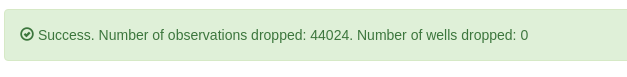

**Rasters**
----------
One of the main functions of the GWDM app is to use temporal and spatial interpolation to create time-varying rasters of groundwater data (water level, depth to groundwater, etc). This process is described in the Mapping section. Interpolated rasters can be animated in the main map window using the Leaflet animation plug-in used by the GWDM.

In some cases, users may elect to use external interpolation algorithms to generate rasters for their aquifers. The Rasters section in the admin control panel can be used to upload and manage these externally generated rasters. Once uploaded, they can be animated and visualized in the GWDM map window.

The **Upload Rasters** command is used to upload raster dataset in netCDF format. The user must first select the region, aquifer, and variable and then choose the netCDF file.

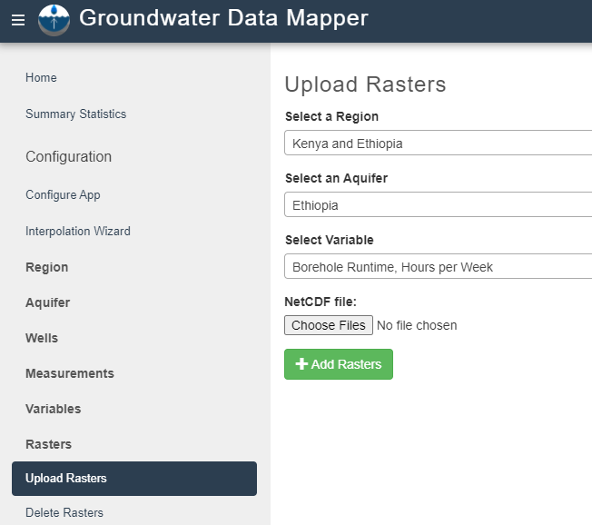

Once a raster has been uploaded, it can be selected for visualization choosing the View Region option, selecting the region, and then selecting the aquifer and variable. The uploaded raster can then be selected using the Interpolation Layer option.

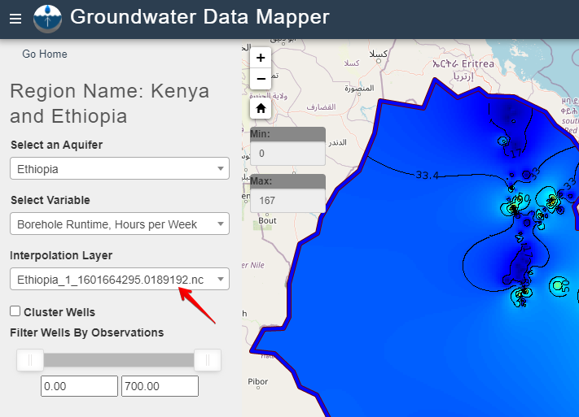

The **Delete Rasters** command is used to delete previously uploaded rasters. The user selects the region, aquifer, variable, and raster and then selects the Delete Rasters button. If the "All Aquifers" option is selected in the "Select an Aquifer" list, all rasters associated with the region are deleted. Likewise, the Variable and Interpolation Layer options both have an "All ___" option to delete all rasters for any variable or all rasters for a selected variable.

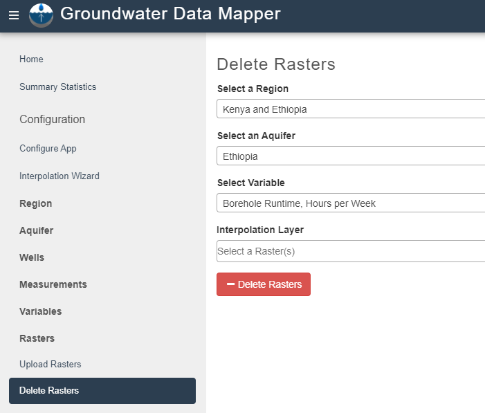

**Trouble Shooting**
------------------
If you are having trouble getting your data to upload correctly, this section includes several common problems and how to fix them.

**CSV Encoding**

If your CSV files are encoded intentionally or accidentally the wizard that gets the attributes will not be able to recognize the attributes. When you open the wizard, it will only show one of the attributes. One way to fix this error is to resave the file with the option highlighted in blue as opposed to the option highlighted in red in the figure below. If this does not work, we recommend copying your data into a new document being sure to save it without the encoding.

 .. image:: images_import/csv_encoding.png
     :scale: 80%
 
 
 **Selecting an Aquifer**
 
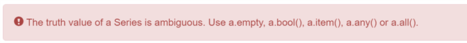
   
If you have received the error pictured above, you selected an aquifer when you did not need to. If you have organized your data using aquifer IDs then the aquifer option blank must be left blank when you are adding wells and measurements. You will need to refresh the page to make the aquifer option blank again and then leave it blank while you are adding your wells. After you refresh be sure to reselect your region.

**Dropped Data**

When adding measurements, care should be taken to only upload measurements associated with wells that have previously been uploaded to the GWDM. Otherwise, the measurements will be skipped when uploading and after the uploading process is complete, a message similar to this will appear: 

   
There are two ways to fix this issue depending on what is causing it. In some cases, the measurements are dropped because the well ID refers to a non-existent well. To fix this you can run our file formatter tool located in the supporting scripts section of this webpage. In other cases, the well is assigned to a non-existent aquifer which can be fixed by running our aquifer assignment tool which can also be found on our supporting scripts page.
