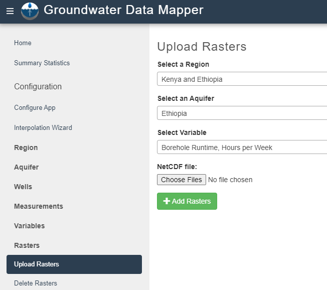

.. raw:: html
   :file: translate.html
   
**Groundwater Level Mapping**
=============================

In addition to visualizing well and measurement data, the GWDM app and associated tools can generate and display rasters of time varying water levels and time series of aquifer storage change. These groundwater maps are in the form of netCDF rasters at selected intervals (yearly for example) over a selected time range. They are generated using a multi-step process that involves imputing gaps in water level time series at wells using Earth observations and machine learning, spatial interpolation of water levels using kriging, and volumetric analysis of the raster results. While the app supports any kind of groundwater data measurements, the mapping tool is designed for water level data. When using the mapping tool, the user selects a start date and an end date and a time interval for the interpolation process. For example, one could choose start = 1980, end = 2010, step = 5 years and the algorithm would generate a raster for 1980, 1985, 1990, ... 2005, 2010. The rasters are compiled into a netCDF file that can then be uploaded and animated in the map interface. Also, the mapping algorithm calculates the volume between each pair of rasters and multiplies the volume by a user-specified storage coefficient to compute a chart of groundwater storage change vs time. This chart can be especially useful in determining if an aquifer is being used in a sustainable fashion as it can demonstrate groundwater depletion.

In previous versions of the GWDM app, this was accomplished using the Interpolation Wizard that was found in the admin control panel. In order to give the user the ability to monitor each step of the process, we have moved the mapping tool to a standalone Google Colab notebook (link below).

To launch the mapping tool, please click on this button. The notebook will open in a new tab. 

.. raw:: html

    

**Overview of Algorithm**
-------------------------
The final aquifer map will include a Water Table Elevation estimate for every point in your aquifer at any time step. Since it is impractical and near impossible to collect all that data, interpolation methods can be applied to fill in for data we do not have. Our interpolation algorithm can be split into two major steps. First, the temporal interpolation of individual well time series. Second, the spatial interpolation between those wells. Each of these is explained in greater detail below.

**Temporal Interpolation**
--------------------------
While some wells have a relatively complete dataset over the period of interest, it is very common to have large gaps in the data record. The goal of temporal interpolation is to create a complete time series for each well that can be easily compared to other wells. The final output of this step will be a timeseries with measurements every month during the entire period of interest. Some measurements are close enough together that it is easy to predict the value at the beginning of the month. This can be done using simple PCHIP interpolation. Some measurements are more difficult to predict. We estimate these values using machine learning.

**Simple PCHIP Interpolation**
~~~~~~~~~~~~~~~~~~~~~~~~~~~~~~
For reference, PCHIP stands for Piecewise Cubic Hermite Interpolating Polynomial. During this step we decide how close measurements must be to justify the use of PCHIP interpolation. We call this value the pad value. The image below shows some example results of PCHIP interpolation. In this example, the pad value was 365 days. Note that PCHIP only interpolates between measurements.

.. image:: images_mapping/PCHIP_NBimage.png
    
**Machine Learning**
~~~~~~~~~~~~~~~~~~~~
For longer periods of interpolation that are harder to predict, we use machine learning to fill in the missing data. The machine learning finds correlations between Earth observations and water level measurements and then uses data imputation to fill in the gaps. For example, groundwater levels generally rise during wet periods due to increased recharge and decreased pumping. Alternately, water levels drop during dry periods due to reduced recharge and increased pumping. The following charts illustrate this relationship using soil moisture anomaly from the Global Land Data Assimilation System (GLDAS) model.

.. image:: images_mapping/soil_moisture_correlation.png

The machine learning algorithms use these correlations to predict missing water levels in gaps in the water level time series. The imputation is performed using a novel multi-linear regression (MLR) algorithm called Extreme Machine Learning (ELM) to impute missing data for infrequently sampled wells. The ELM is trained with water levels and the time-varying NASA Global Land Data Assimilation System (GLDAS) soil moisture dataset for the region in question. Sample imputation results are shown below.

.. image:: images_mapping/imputation_results.png

**Spatial Interpolation**
~~~~~~~~~~~~~~~~~~~~~~~~~
Once the time series are complete, the time series curves for each well are sampled at the selected dates and spatial interpolation is performed to build the rasters. The algorithm applies GSLIB(Geostatistical Software Library) Kriging code to generate rasters with the user specified time steps. For the Kriging algorithm, we autofit a variogram to the data in the aquifer based on the size of the aquifer.

To learn more about these methods, see the papers published in `Remote Sensing <https://www.mdpi.com/2072-4292/12/12/2044>`_ and `Environmental Modelling & Software journals <https://www.sciencedirect.com/science/article/pii/S1364815220301997?via%3Dihub>`_. 

**Water Level Mapping Google Colab Notebook**
~~~~~~~~~~~~~~~~~~~~~~~~~~~~~~~~~~~~~~~~~~~~~
To run the water level mapping algorithm, you will first need to prepare your data. The algorithm requires three inputs as described in the following table. These are the same files (same content and format) that you would use to upload your original data to the GWDM mapper to visualize your wells and water level measurements. The only difference is that the aquifer file should only contain a single aquifer, while you could upload multiple aquifers at once to the GWDM app.

+-------------------------+-----------------------------------------------------------------------------------------------------------------------------------------------------------------------+
| File                    | Description                                                                                                                                                           |
+-------------------------+-----------------------------------------------------------------------------------------------------------------------------------------------------------------------+
| Aquifer boundary        | This file contains a polygon of the aquifer boundary and can be in either shapefile or GEOJSON format. If it is a shapefile, you should include the .shp, .shx, and |
|                         | .dbf files and they should be combined into a single ZIP archive. The file should contain only one aquifer.                                                          |
+-------------------------+-----------------------------------------------------------------------------------------------------------------------------------------------------------------------+
| Well locations          | This is a CSV file of the well locations formatted as described in the Data Preparation page.                                                                         |   
+-------------------------+-----------------------------------------------------------------------------------------------------------------------------------------------------------------------+
|Water level measurements | This is a CSV file of the groundwater level measurements formatted as described in the Data Preparation page.                                                         |
+-------------------------+-----------------------------------------------------------------------------------------------------------------------------------------------------------------------+

As you follow the instructions in the notebook and move from section to section, you will be prompted to select a series of options. The following table provides a guide on these options:

.. list-table:: 
     
   * - Parameter
     - Description
   * - Select Drawdown Volume Units
     - These units are used to compute the groundwater storage change vs. time curve. The options are Acre-Ft, Cubic Metric (m^3), and Cubic-Ft. The units you select should match the units associated with the selected variable. If your variable is in meters, you should select the Cubic Meter (m3) option. If your variable is in feet, you can select either of the other two options.
   * - Output file name
     - A default name will be generated by the application. The default name will be appended to your input. The format will be yourinput_regionname_interp_somenumber.
   * - Storage Coefficient
     - A typical value would be 0.15 to 0.20. For unconfined aquifers, this should be the specific yield. For more information on storage coefficients, visit this link. This parameter is used to compute the groundwater storage change vs time curve that is generated as part of the interpolation process.
   * - Raster Extent
     - The extent of the interpolated raster is based on either the extent of the wells or the aquifer. If the wells option is selected, the resulting raster will be a rectangular box that just surrounds the wells and it is clipped by the aquifer boundary. If the aquifer option is selected, the spatial interpolation process extrapolates out to the limit of the aquifer and is clipped by the aquifer. In order to get a storage change vs time curve for the            entire aquifer, you should generally select the aquifer option.
   * - Time Interval
     - This indicates the frequency at which the spatial interpolation process generates a raster using kriging over the interpolation interval. For example, you select 1980 and 2020 as the starting and ending dates and a time interval of 5 years, you would get interpolated rasters at 1980, 1985, 1990, ... 2020.
   * - Interpolation start and end dates
     - These two parameters set the date range for interpolation (i.e., the beginning and ending of the raster data set). For better results, select a range that is at least 10 years in length.
   * - Gap Size
     - The minimum length of time over which the application will generate spatial interpolation layers using ELM (Extreme Machine Learning) for an individual well. After applying PCHIP interpolation to the entire range of times, the algorithm scans for gaps between measurements. If they are larger than the gap size, the PCHIP values are converted to NaNs for all times in the gap except for the pad size (see next item) and the values are then imputed using machine learning. We recommend a gap size of 1-2 years (365-730 days) for best results.
   * - Pad Value
     - The pad value determines when to use PCHIP interpolation at the ends of gaps. If the time between measurements is greater than the gap value, the PCHIP values are removed for later imputation. However, a set of PCHIP values up to the pad size are left at the two edges of the gap (next to the measurements). We recommend a gap value between 90 to 180 days.
   * - Spacing
     - Time between two points in the well data interpolation process, a month apart (1MS = 1 Month spacing, at the Start of the month). This is typically 1 month. The algorithm then creates a time series for each well with one-month intervals. The entries are filled with actual measurements and then PCHIP interpolation is used to fill gaps smaller than the pad size. Any remaining gaps are filled using the ELM machine learning process. Once the gaps        are filled, values are extracted at each time interval and spatial interpolation is performed.
   * - Min water level samples per well
     - The minimum number of measurements a well needs to be included in the temporal and spatial interpolation process. Wells with less than this number are ignored.

The graphic below illustrates the parameters of pad value, gap size, and interpolation start and end dates also referred to as the interpolation range. As you can see in the figure, the interpolation is only completed within the range given. If the time between measurements is smaller than the pad value PCHIP interpolation is used. If it is larger, then ELM is used. However, if the time between measurements is larger than the gap size, then that particular well is dropped during interpolation.

.. image:: images_mapping/interp_type_graphic.jpg
   :scale: 65%
   
**Sample Data and Parameters**
------------------------------
To get started, here are two data sets of files; however, you are welcome to use your own files if you would prefer.

:download:`sunflower_test_files.zip </test_files/sunflower_test_files.zip>`

:download:`korama_test_files.zip </test_files/korama_test_files.zip>`
  
The Mapping Google Colab Notebook has parameters that can be set and changed by the user to obtain desired results. Here is a summary of each parameter with a suggestion. We will use the sample data provided ( Sunflower test files)

.. list-table::
   :widths: 20 20

   * - **Parameter**
     - **Sunflower Aquifer**
   * - Interpolation Start Date
     - 2001
   * - Interpolation End Date
     - 2021
   * - GAP Size
     - 3650 days
   * - Minimum Water Level Samples per Well
     - 5 samples
   * - Temporal Interpolation Method
     - P-chip & Extreme Learning Machine

**Uploading and Viewing the Mapping Results**
---------------------------------------------
When the algorithm completes the calculations in the Colab notebook, it will generate a netCDF file containing the time varying rasters and the groundwater storage change time series. You can download that file from your Google Drive and then upload it to the GWDM app using the tools in the Rasters section of the admin control panel. This process is described in the Rasters section near the bottom of the Importing Data page.

To view your uploaded rasters, return to the region's map by navigating to the home page. After selecting the aquifer within which you performed the interpolation, you can view the interpolation results by using the Interpolation Layer dropdown menu. Here are some sample results for an aquifer in Utah, USA and Niger.

.. figure:: images_mapping/interp_CedarValley.gif
   :scale: 65%
   
   **Cedar Valley, Utah Interpolation Results**
   
   

   
   **Goulbi Maradi, Niger Interpolation Results**
  
   
To view the storage change vs time curve, click on the **View Drawdown Volume** button. The storage change curve will then appear in a new window.
